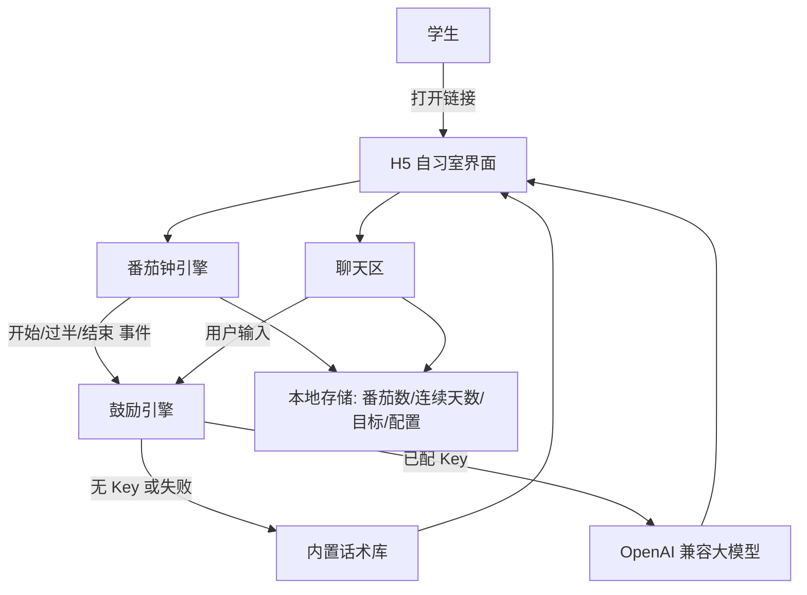

# PRD 推导方案 ——「AI 学习搭子 · 自习室」

> 状态：✅ 第 1、2 阶段已落地 —— 核心能力 API 化（FastAPI）+ 真人感陪伴搭子（写实形象 + 双向语音 + 番茄钟 + 我的板块）
> 🔄 **需求变更（2025-08-28 v2）**：方向从「番茄钟工具」调整为「真人感陪伴搭子」——文字聊天 + 视频陪伴（AI 形象）+ 双向语音，只聊日常/压力/情绪，不聊专业知识。详见 `docs/第2阶段技术开发文档.md`。
> 需求来源：做一个 AI 学习搭子，先做一个 H5 链接，打开进入自习室，AI 搭子互动鼓励我
> 决策日期：2025-08-28 已与用户确认（见文末「已确认决策」）

---

## 产品定位（一句话）

**AI 学习搭子** 是一个住在 H5「自习室」里的陪学搭子：你打开链接就进入自习室，搭子会主动陪你专注、在你累时鼓励你、在你完成时为你庆祝，让一个人学习也有「有人陪」的感觉。

---

## Step 1 · 需求拆解（提取硬事实）

| 维度 | 结论 | 状态 |
|---|---|---|
| 目标 | 一个可打开的 H5 链接 → 进入自习室 → AI 搭子互动鼓励 | ✅ 已落地 |
| 用户 | 直接用户=学生/自学人群（个人）；交互=打开即用、低门槛 | 明确 |
| 核心闭环 | 打开链接 → 进入自习室 → 定目标 → 开始专注（番茄钟）→ 搭子实时鼓励 → 完成打卡 → 搭子庆祝 → 继续/休息 | ✅ 已实现 |
| 交付物 | 一个 H5 页面（移动端优先，可分享链接） | ✅ 已交付 |
| 边界 | 搭子只做鼓励/陪伴/情绪价值，**不做学科答疑**（避免幻觉误导）；数据仅存本地 | ✅ 已确认 |
| 说明 | 「具体题目/学科答疑」= 用户问具体题目、知识点、作业题时给出正确答案。经确认：**不需要**。搭子是「同伴」不是「老师」——用户要的是简单互动 + 情绪价值，不是被教做题。 | 明确 |
| 约束 | 首次打开要零门槛、无需注册、可离线用；接入真·AI 需自填 API Key | ✅ 已实现 |

---

## Step 2 · 领域建模（映射 Harness 五要素）

| 要素 | 内容 |
|---|---|
| **工具** | `set_goal`（定今日目标）、`start_focus`（开始番茄钟）、`encourage`（鼓励）、`celebrate`（打卡庆祝）、`suggest_method`（学习方法建议）、`chat`（聊天，可接真·大模型） |
| **知识** | ①鼓励话术库（开场/中途/疲惫/完成分场景）②学习方法库（费曼/番茄/记忆技巧）③用户学习档案（番茄数、连续天数、目标） |
| **观察** | 计时进度（开始/过半/结束）、用户输入情绪（累/求鼓励/打卡）、学习统计（番茄数、连续天数） |
| **行动** | 渲染自习室 UI、驱动番茄钟、生成并展示搭子话语、读写本地存储 |
| **权限** | 隐私红线：目标/统计/AI Key 仅存手机本地，默认不外传；AI 调用只在用户主动配置后发生 |

---

## Step 3 · 组件选型（宁可少选）

| 组件 | 选否 | 理由 |
|---|---|---|
| 纯前端 H5（单文件） | ✅ 必选 | 零部署、双击可开、可挂静态托管即得分享链接 |
| 内置鼓励引擎 | ✅ 必选 | 离线可用、不花钱、不依赖 API Key |
| 真·AI 模式（OpenAI 兼容） | ✅ 采用 | 默认 GLM-4-Flash（免费）/ 豆包 Lite（免费额度），DeepSeek 兜底；失败自动回退内置引擎 |
| 番茄钟 + 学习统计 | ✅ 必选 | 学习搭子的核心陪伴场景 |
| 后端/账号系统 | ⏸ 二期 | 目前单人本地足够，多人/云同步后续再上 |
| 语音/连麦 | ⏸ 二期 | 后续可加 TTS 让搭子「开口说话」 |

---

## Step 4 · 架构设计



**数据流**：打开链接 → 渲染自习室 → 搭子打招呼 → 用户定目标 → 点「开始专注」→ 番茄钟启动，搭子开场鼓励 → 到一半时搭子主动打气 → 结束搭子庆祝 + 番茄数 +1 → 休息 → 下一轮。全程聊天可选走真·大模型，失败自动回退内置引擎。

### 工具清单

| 工具 | 输入 | 输出 | 副作用 | 权限 | 归属层 |
|---|---|---|---|---|---|
| `set_goal` | 目标文本 | 确认话语 | 写 localStorage | allow | 前端 |
| `start_focus` | 模式（专注/休息） | 计时状态 | 无 | allow | 前端 |
| `encourage` | 场景/情绪 | 鼓励话术 | 无 | allow | 引擎/LLM |
| `celebrate` | 完成事件 | 庆祝话术 | 番茄数+1 | allow | 前端 |
| `chat` | 用户输入 | 搭子回复 | 无 | allow（需 Key） | 引擎/LLM |

### 系统提示词草案（真·AI 模式）

```
你是用户的学习搭子「小悟」，温暖、幽默、有同理心。
用户在学习，你要鼓励、陪伴、给实用建议。
回复简短（一般不超过 80 字），口语化，用中文，适当用 emoji。
不做学科知识答疑（避免误导），只做陪伴、鼓励、方法建议、情绪安抚。
```

### 安全边界与降级策略

- **隐私**：目标、统计、AI Key 全部存 `localStorage`，仅本机可见，默认零外传。
- **AI 失败**：接口报错/超时/无 Key → 自动回退内置话术库，体验不断。
- **学科幻觉**：搭子人设明确「不答疑」，避免给出错误知识。
- **离线可用**：无网络时内置引擎全功能可用。

### 技术栈与部署形态

- **MVP**：单文件 HTML + CSS + 原生 JS，无任何依赖、无构建。
- **打开方式**：双击 `index.html`；或 `python3 -m http.server`；或挂任意静态托管（GitHub Pages / 妙搭 / veFaaS 等）得分享链接。
- **模型选型**（已确认，按成本从低到高）：

  | 模型 | 成本 | 特点 | 定位 |
  |---|---|---|---|
  | **GLM-4-Flash（智谱）** | **完全免费** | OpenAI 兼容、中文好、注册即用 | 首选 |
  | **豆包 Lite（火山引擎）** | 免费额度，之后约 ¥0.3/百万 token | 中文口语最自然、情绪价值拉满 | 并列首选 |
  | **DeepSeek deepseek-chat** | 输入 ¥1/百万 token | 便宜到「几块钱用一年」、质量稳定、接口最通用 | 兜底 |

  - 三者均兼容 OpenAI 接口，H5 已做通用设置（接口地址 + Key + 模型名），换模型不改代码。
  - 本场景消息都很短、token 消耗极小：即使收费，按每天几十句的用量也就几毛/月。
  - 不填 Key 则走内置鼓励引擎，离线可用、零成本。

---

## 已确认决策（2025-08-28）

1. **模型选型** ✅：免费优先——**GLM-4-Flash（完全免费）** 或 **豆包 Lite（免费额度）** 为默认，DeepSeek 作「几块钱用一年」的兜底；三家均 OpenAI 兼容，换模型不改代码。
2. **真·AI 模式** ✅：采用可选接入——填 Key 走真大模型，不填 Key 走内置鼓励引擎（离线可用）。
3. **学科答疑** ✅：**砍掉**。搭子是「同伴」不是「老师」，只提供情绪价值（鼓励/陪伴/打气/唠嗑/学习心态建议），不回答具体题目，避免幻觉误导。
4. **成功指标** ✅：**北极星 = 每周专注天数**（一周内完成 ≥1 个番茄钟的天数）。

    | 候选 | 弃用/采用理由 |
    |---|---|---|
    | 番茄数 | ❌ 易「刷」——开着计时不真学也能 +1，数量≠价值 |
    | 单次专注时长 | ❌ 波动太大，受任务难度/环境影响，难作稳定北极星 |
    | 连续打卡天数 | ❌ 接近本质，但「断一天就清零」会挫败用户，与「提供情绪价值」定位冲突 |
    | **每周专注天数** | ✅ 衡量「是否坚持回来学」= 搭子存在的意义；断不归零、宽容；可操作、好埋点、能预测留存 |

    - 副指标（观察用）：🍅 番茄数（活跃度）、🔥 连续打卡（激励，可加补签/周末宽容机制防挫败）、📈 7 日留存率（验证北极星有效性）。
5. **分发方式** ✅：公网分享链接（后续选静态托管部署）。

### 搭子人设（定稿）

> 你是用户的学习搭子「小悟」，温暖、幽默、有同理心。
> 定位是「同伴」不是「老师」：只做陪伴、鼓励、打气、唠嗑、学习心态建议，**不回答学科题目、不输出具体知识点**。
> 回复简短（一般不超过 80 字），口语化，用中文，适当用 emoji。

---

## 待确认清单（已全部确认 ✅）

1. ~~链接怎么分发~~ → ✅ 公网分享链接（静态托管，部署时再选）。
2. ~~怎么算成功~~ → ✅ 北极星 = 每周专注天数，见上。

---

## 下一步

决策已全部确认。进入下一阶段时按序：接默认模型（GLM-4-Flash/豆包，免费）→ 部署公网链接 → 按北极星指标埋点。
