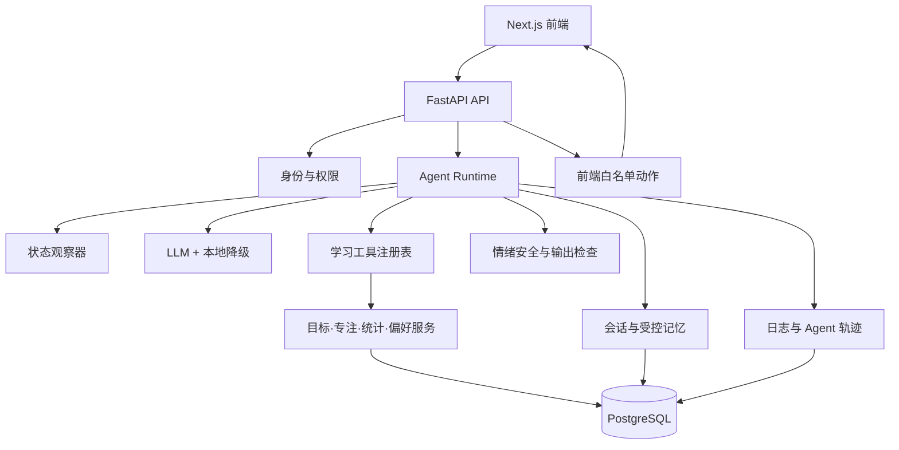

# AI 学习搭子后端开发技术适配声明

> 适用范围：P0-A 至 P2 的完整后端改进过程  
> 配套文档：《开发排期手册.md》《项目改进迭代方案.md》及各阶段开发技术手册  
> 当前状态：已确认；P1-C 工程开发及隔离自动验收完成，人工安全复核、真实模型冒烟与 PostgreSQL 实库验收待执行
> 文档性质：项目级技术适配总声明。各阶段技术开发文档必须引用本声明，并只记录本阶段的适配摘要和变化项。  
> 更新原则：只有架构、数据、安全、模型、外部服务或部署方案发生重要变化时，才更新本声明；普通 Bug 修复不重复生成新声明。

---

## 一、声明目的

本声明用于统一整个后端开发过程中的技术路线，避免每个阶段各自选择技术，导致架构、数据和安全规则相互冲突。

它主要回答：

1. 当前项目是什么形态。
2. 后端最终要升级成什么形态。
3. 每个阶段采用哪些技术方案。
4. 哪些 Agent Harness 组件必须建设。
5. 哪些复杂能力明确暂缓。
6. 哪些安全底线在所有阶段都不能改变。
7. 哪些关键决策必须确认后才能开发。

本声明不能代替阶段开发技术手册。二者关系为：

| 文档 | 作用 | 使用方式 |
|---|---|---|
| 后端开发技术适配声明 | 统一整个后端开发过程的技术路线和边界 | 项目级一份，持续更新 |
| 阶段开发技术手册 | 说明某个阶段具体改哪些文件、如何实现和验收 | 每个阶段一份 |
| 阶段验收记录 | 记录实际完成内容、测试结果和遗留问题 | 每个阶段完成后生成 |

---

## 二、产品与技术形态判断

### 2.1 产品定位

AI 学习搭子是一个移动端优先的学习陪伴产品，核心用户闭环为：

```text
登录
→ 设定今日学习目标
→ 与搭子交流
→ 开始专注
→ 获得适度陪伴
→ 完成结算
→ 查看统计与总结
```

产品定位是“学习同伴”，不是学科老师：

- 可以陪聊学习压力、情绪、习惯和日常话题。
- 可以协助设置目标、开始专注和查看进度。
- 不回答具体学科题目，不替代专业教师。
- 不冒充心理医生，不做医疗诊断。

### 2.2 当前技术形态

| 层级 | 当前实现 | 当前判断 |
|---|---|---|
| 正式前端 | Next.js 16 + React 19 + TypeScript | 继续使用 |
| 正式后端 | FastAPI + Pydantic + httpx | 继续使用 |
| AI 对话 | 每条消息单次调用 LLM | 可用，但不是 Agent 循环 |
| 本地降级 | 关键词匹配话术 | 继续保留 |
| 语音输出 | Edge TTS | 继续保留，需统一错误处理 |
| 语音输入 | 浏览器 Web Speech API | 属于前端能力 |
| 登录 | 邀请码直接映射用户 ID | 需要重构 |
| 数据 | 用户目录下的 JSON 文件 | 需要迁移数据库 |
| 部署 | veFaaS 前后端独立部署 | 继续使用，后端改为无状态服务 |
| 测试 | pytest、ESLint、Playwright | 继续使用并统一入口 |

### 2.3 当前是否属于 Agent Harness

当前产品属于“带 AI 能力的学习应用”，还不是完整 Agent Harness。

主要原因：

- 没有“判断—工具调用—观察结果—继续判断”的 Agent 循环。
- 已有 API 不是模型可调用的 Agent 工具。
- 模型看不到完整的学习状态。
- 模型不能通过受控协议请求前端执行动作。
- 没有会话记忆和受控长期记忆。
- 没有独立的 Agent 工具权限和轨迹记录。

后端开发目标不是推倒现有应用，而是在现有服务上逐步增加轻量 Agent Runtime。

---

## 三、总体技术目标

后端最终应形成以下结构：



总体原则：

- 保留 FastAPI，不更换后端框架。
- 保留 Next.js 前端，不重做产品外壳。
- 后端部署保持无状态，持久数据进入外部数据库。
- Agent 只拥有学习产品需要的少量工具。
- AI 不能直接修改番茄数或绕过用户确认。
- 所有关键动作必须可追踪、可拒绝、可重试。
- 模型失败时，基本陪伴和计时功能仍然可用。

---

## 四、完整开发阶段适配表

| 阶段 | 阶段目标 | 核心技术调整 | 是否改变架构 | 适配处理 |
|---|---|---|---:|---|
| P0-A | 建立可信开发基线 | 正式版本收敛、配置校验、健康检查、测试隔离 | 小 | 按本声明执行，不增加业务能力 |
| P0-B | 修复现有产品错误 | 统计重算、番茄幂等、语音状态、登录态 | 小 | 沿用当前架构，阶段文档写适配摘要 |
| P0-C | 账号与数据可靠化 | PostgreSQL、数据迁移、独立用户身份、Token 撤销 | 大 | 必须严格遵守本声明的数据和身份方案 |
| P1-A | 建立 Agent 基础层 | 输入输出协议、工具注册、观察器、工具权限 | 大 | 引入轻量 Agent Runtime 基础层 |
| P1-B | 打通 Agent 学习闭环 | 有限 Agent 循环、前端动作、今日目标闭环 | 大 | 沿用 P1-A 方案，不另建第二套 Agent 架构 |
| P1-C | 记忆、安全与可观测性 | 会话记忆、长期偏好、情绪安全、Agent 轨迹 | 大 | 更新本声明的隐私和记忆部分即可 |
| P2 | 主动陪伴与运营 | 规则触发、埋点、总结、数据管理 | 中 | 先验证数据价值，再增加后台能力 |
| P3 | 长期候选功能 | 数字人、多人自习室等 | 未定 | 不在本声明承诺范围内，需单独立项 |

---

## 五、统一技术选型

### 5.1 后端框架

采用：

- Python 3.11 或部署平台支持的稳定 Python 3.12。
- FastAPI 作为 HTTP API 框架。
- Pydantic 作为请求、响应、配置和工具参数校验层。
- httpx 作为 LLM 等 HTTP 服务客户端。

不采用：

- 不更换为其他 Web 框架。
- 不为了 Agent 能力引入庞大的第三方 Agent 框架。
- 不让业务服务直接依赖具体模型厂商。

适配原因：现有 FastAPI 结构清晰、测试基础完整，轻量 Agent Runtime 可以直接建立在现有服务之上。

### 5.2 数据库

采用：

- 本地开发：SQLite。
- 自动测试：临时 SQLite 或独立测试数据库。
- 正式环境：PostgreSQL 或平台提供的兼容托管数据库。
- 数据访问：SQLAlchemy 2.x。
- 数据库版本管理：Alembic。

适配原因：

- JSON 文件不能支持 serverless 多实例共享。
- 当前统计、身份、会话和记忆需要事务与关联查询。
- 本地 SQLite 降低开发门槛，PostgreSQL 满足线上可靠性。

强制要求：

- API 不直接拼接 SQL。
- 数据库修改必须通过迁移文件管理。
- 写入学习完成记录必须具有唯一 ID 和幂等约束。
- JSON 迁移成功并核对前，不删除原始文件。
- 正式环境不使用本地 SQLite 文件作为共享数据库。

### 5.3 用户身份与邀请机制

采用原则：

```text
邀请码负责允许注册
用户账号负责识别具体用户
用户 ID 负责关联个人数据
```

强制要求：

- 同一个邀请码可以按规则创建多个独立用户，但不能让多人共享同一用户 ID。
- 邀请码支持有效期、次数限制和停用。
- Token 支持过期、退出登录和服务端撤销。
- 生产邀请码不写入代码、测试和公开文档。
- 用户只能访问属于自己的目标、专注、历史、聊天和记忆。

具体采用邮箱、手机号、一次性注册凭证或其他恢复方式，需要在 P0-C 开发技术手册中确认。本声明不擅自决定需要付费外部服务的登录渠道。

### 5.4 Agent Runtime

采用自研轻量循环，不引入多 Agent 框架。

单次请求流程：

```text
读取用户输入和必要状态
→ 调用模型
→ 如果模型请求工具，则校验权限并执行
→ 将工具结果返回模型
→ 模型继续判断或输出最终回复
→ 达到停止条件后结束
```

强制限制：

- 单次请求有最大循环轮数。
- 单次请求有最大工具调用数量。
- 整体请求有总超时。
- 模型不调用工具时正常结束。
- 达到上限或发生异常时安全结束。
- 不向 Agent 提供 Shell、任意文件读写或任意网络访问工具。
- 模型输出必须经过结构校验。

### 5.5 Agent 工具

第一批工具限定为：

| 工具 | 作用 | 权限策略 |
|---|---|---|
| `get_today_goal` | 查看今日目标 | 自动允许 |
| `set_today_goal` | 设置今日目标 | 用户明确表达后允许 |
| `get_focus_state` | 查看当前专注状态 | 自动允许 |
| `request_start_focus` | 建议并请求开始专注 | 前端必须让用户确认 |
| `request_pause_focus` | 请求暂停专注 | 用户明确表达后允许 |
| `complete_focus` | 结算有效专注 | 校验用户、状态和唯一 `sessionId` |
| `get_study_stats` | 获取学习统计 | 自动允许，仅限本人数据 |
| `update_preference` | 修改搭子或语音偏好 | 用户明确表达后允许 |

工具采用统一注册表，必须包含：

- 名称。
- 用途描述。
- 输入参数结构。
- 返回结果结构。
- 是否产生数据变化。
- 权限等级。
- 超时和错误处理。

未注册工具永远不能执行。

### 5.6 前后端动作协议

后端不能直接控制浏览器计时器，应向前端返回白名单动作：

```json
{
  "reply": "我们先专注 25 分钟吗？",
  "actions": [
    {
      "type": "confirm_start_focus",
      "durationMinutes": 25
    }
  ]
}
```

前端要求：

- 只识别约定动作。
- 未知动作不执行。
- 开始专注等关键动作必须由用户确认。
- 执行或拒绝结果需要返回后端。

后端要求：

- 只输出白名单动作。
- 动作参数通过 Pydantic 校验。
- 不能把模型原始 JSON 直接交给前端执行。

### 5.7 记忆

采用两层记忆：

| 类型 | 保存内容 | 保存策略 |
|---|---|---|
| 会话内记忆 | 最近聊天和当前话题摘要 | 自动保存，限制长度 |
| 受控长期记忆 | 稳定学习偏好和用户明确要求记住的信息 | 白名单保存，可查看、修改和删除 |

禁止自动长期保存：

- 临时负面情绪。
- 医疗和其他高度敏感信息。
- 模型根据聊天自行推测的用户特征。
- 完整原始语音。
- 与学习陪伴无关的私人信息。

用户最新明确指令优先于旧记忆。

### 5.8 情绪安全

采用“程序规则 + 固定安全回复 + 模型陪伴表达”的组合方式，不能只依赖 Prompt。

最低分级：

| 等级 | 示例 | 处理方式 |
|---|---|---|
| 普通疲惫 | 累、困、不想学 | 建议休息或调整节奏 |
| 明显焦虑 | 压力很大、持续崩溃感 | 温和陪伴，建议联系可信的人 |
| 明显危机 | 自伤、自杀或紧急危险表达 | 停止普通陪聊，进入固定安全流程并引导及时求助 |

强制边界：

- 不做诊断。
- 不承诺绝对保密。
- 不把高风险内容当作普通鼓励场景。
- 安全判断失败时采用更保守的处理。

### 5.9 日志与可观测性

采用结构化日志和 Agent 事件轨迹。

至少记录：

- 请求 ID、用户匿名 ID、接口和耗时。
- 模型调用成功、失败和降级来源。
- 工具名称、权限判断、执行结果和耗时。
- 数据库、TTS 和动作协议错误。
- 番茄钟结算结果。

禁止记录：

- API Key。
- 完整 Token。
- 完整邀请码。
- 数据库密码。
- 完整敏感聊天内容。

### 5.10 外部服务与模型

- 模型调用通过兼容客户端层封装，不让业务代码绑定单一厂商。
- 无 Key、超时、非成功响应或空回复时继续使用本地话术。
- TTS 失败时返回文字，不阻断聊天。
- 自动测试不调用真实 LLM 和 TTS。
- 真实模型冒烟测试单独执行，并明确记录所用环境和结果。
- 新增外部服务前必须说明费用、隐私、数据流向和降级方式。

### 5.11 部署

继续采用前后端独立部署：

- 前端：Next.js standalone。
- 后端：FastAPI 无状态服务。
- 数据：外部 PostgreSQL，不依赖函数实例本地磁盘。
- 健康检查：`GET /health`。
- 配置和密钥：部署平台环境变量。

后端实例可以被重建，重建后不应丢失账号、学习、聊天和记忆数据。

---

## 六、各阶段具体适配要求

### 6.1 P0-A：可信开发基线

采用：

- `frontend/` 作为唯一正式前端。
- `backend/` 作为纯 API 后端。
- 历史 H5 移动到 `archive/`，不直接删除。
- 后端新增 `/health`。
- `.env.example` 补齐登录、安全、环境和时区配置。
- 自动测试使用测试邀请码、测试密钥和临时数据目录。
- 在 Turbopack 问题解决前，生产构建使用 webpack。

不做：业务逻辑修复、数据库、Agent 和记忆。

### 6.2 P0-B：现有产品错误修复

采用：

- 本周专注天数和连续天数从每日历史计算。
- 时区显式使用用户时区，默认 `Asia/Shanghai`。
- 每轮专注使用唯一 `sessionId`。
- 完成接口具有幂等保护。
- 保存失败时不在前端制造假成功。
- 语音设置由所有页面共享。
- Token 有效性通过后端结果确认。

不做：数据库迁移和 Agent 化。

### 6.3 P0-C：账号与数据可靠化

采用：

- SQLAlchemy + Alembic。
- 本地 SQLite、线上 PostgreSQL。
- JSON 数据只作为迁移来源和短期备份。
- 邀请码与用户身份分离。
- Token 支持服务端撤销。
- 业务服务通过 repository 层访问数据。

数据切换条件：

- 完成备份。
- 迁移数量核对一致。
- 重复迁移不会产生重复数据。
- 回滚流程经过验证。
- 所有 API 已切换数据库。

### 6.4 P1-A：Agent 基础层

当前实施状态：已按本声明完成工程实现与隔离自动验收；尚未接入正式聊天循环，人工确认结果记录在《第四阶段验收记录.md》。

采用：

- Pydantic 定义 Agent 输入、输出、工具和动作协议。
- 建立工具注册表、状态观察器和权限判断器。
- 已有业务服务作为工具处理器复用，不复制业务逻辑。
- Agent 只接收完成当前任务需要的最小上下文。

### 6.5 P1-B：Agent 学习闭环

当前实施状态：第五阶段手册 B01—B18 已确认，允许在 `phase/p1-b-agent-loop` 隔离开发；不授权真实模型测试、生产数据库连接或部署。

采用：

- 有限 Agent 循环。
- 白名单前端动作协议。
- 用户确认后才能开始专注或执行关键修改。
- 今日目标按用户和日期保存。
- 学习完成后由程序计算事实，模型只负责自然语言总结。

### 6.6 P1-C：记忆、安全和可观测性

当前实施状态：第六阶段手册 C01—C24 已确认，工程开发与隔离自动验收已完成；人工安全复核和真实服务仍待验。

采用：

- 最近消息 + 会话摘要。
- 受控长期偏好记忆。
- 程序化情绪安全检查。
- 结构化日志和 Agent 事件轨迹。
- 用户可查看、修改和删除长期记忆。

### 6.7 P2：主动陪伴与运营

采用：

- 专注开始、过半和完成由确定性事件触发。
- AI 只负责生成自然表达，不自行无限决定打扰时间。
- 主动提醒必须允许用户关闭。
- 产品指标由程序采集和计算。
- 学习总结只能引用真实数据。
- 用户可以查看、导出和删除自己的数据。

---

## 七、明确偏离或暂缓的方案

| 候选方案 | 当前决定 | 原因 | 重新评估条件 |
|---|---|---|---|
| 一次性引入全部 `agent-blueprint` 组件 | 不采用 | 当前产品不需要全部复杂机制 | 出现对应真实需求时 |
| 多 Agent 团队 | 暂缓 | 学习搭子核心任务单一 | 出现可并行的独立复杂任务 |
| MCP 插件 | 暂缓 | 当前工具均为内部学习能力 | 需要接入日历、任务或其他外部生态 |
| 复杂任务系统 | 暂缓 | 当前以一次学习会话为主 | 出现跨日复杂任务依赖 |
| 工作流运行时 | 暂缓 | 现有流程可由业务代码和轻量循环完成 | 编排出现多阶段续跑需求 |
| 实时数字人 | 暂缓 | 成本高，不能解决当前数据和 Agent 缺口 | 用户数据证明视觉拟真影响留存 |
| serverless 本地 JSON | 淘汰 | 数据不可靠且多实例不共享 | 不再恢复为正式方案 |
| Prompt 作为唯一安全边界 | 不采用 | 模型可能不稳定或被绕过 | 不再恢复为唯一方案 |
| Turbopack 默认构建 | 临时暂缓 | 当前环境构建失败 | 独立验证通过后恢复 |

---

## 八、全程强制底线

### 8.1 配置和密钥

- `.env` 不进入版本库。
- `.env.example` 不包含真实值。
- 生产环境禁止默认 `AUTH_SECRET`。
- 生产邀请码不出现在公开文档。
- 日志和错误响应不回显秘密。

### 8.2 数据

- 用户只能读取和修改自己的数据。
- 迁移前必须备份。
- 重要写入具有事务或幂等保证。
- 不以删除旧数据作为迁移成功证明。
- 数据删除必须由用户明确发起并可审计。

### 8.3 Agent

- 工具必须注册后才能调用。
- 工具参数必须校验。
- 敏感动作必须确认。
- Agent 有轮数、工具数和超时限制。
- 模型不能直接写数据库或修改统计事实。
- 工具失败必须返回结构化结果。

### 8.4 测试

- 自动测试不调用生产外部服务。
- 自动测试不读写真实用户数据。
- 每个阶段完成后执行回归测试。
- mock 测试不能冒充真实模型验收。
- 发布前必须完成对应人工主链路验收。

### 8.5 隐私与安全

- 明确说明文字、ASR、LLM 和 TTS 的数据流向。
- 不自动长期保存敏感情绪内容。
- 用户能够删除聊天、记忆和账号数据。
- 危机表达进入固定安全流程。
- 新增第三方服务前必须重新评估隐私和合规。

---

## 九、统一测试与验收策略

### 9.1 自动测试层级

| 测试层 | 主要验证内容 |
|---|---|
| 单元测试 | 统计、权限、工具、记忆筛选和安全规则 |
| Repository 测试 | 数据写入、事务、幂等和用户隔离 |
| API 测试 | 登录、目标、专注、历史、聊天和错误结构 |
| Agent 测试 | 工具选择、循环停止、权限拒绝和失败降级 |
| 前端测试 | 状态展示和白名单动作 |
| E2E | 从登录到目标、专注、结算和统计的完整流程 |

### 9.2 真实服务验收

真实 LLM、TTS 和线上数据库冒烟测试与自动测试分开：

- 必须明确测试环境。
- 不使用真实用户数据。
- 记录模型、接口、成功结果和失败降级。
- 测试结束后清理测试数据。
- 未执行真实冒烟时必须标记“待验”，不能用 mock 结果替代。

### 9.3 阶段完成规则

每个阶段只有同时满足以下条件才算完成：

1. 阶段开发技术手册中的任务已完成。
2. 相关自动测试全部通过。
3. 人工主链路验收通过。
4. 没有违反本声明的强制底线。
5. README、API 和数据说明已经同步。
6. 已生成阶段验收记录。
7. 范围外问题已经记录，没有顺手扩大开发范围。

---

## 十、项目级风险与应对

| 风险 | 等级 | 应对方式 |
|---|---|---|
| JSON 数据在 serverless 环境丢失 | 高 | P0-C 迁移 PostgreSQL，迁移前保持备份 |
| 同一邀请码用户共享数据 | 高 | 邀请码与独立用户身份分离 |
| Agent 误执行动作 | 高 | 工具白名单、权限判断、用户确认和幂等校验 |
| 长期记忆保存敏感内容 | 高 | 白名单记忆、用户管理入口和默认不保存 |
| 情绪危机被普通话术处理 | 高 | 程序化分级和固定安全流程 |
| 模型或 TTS 服务不可用 | 中 | 超时、有限重试、本地话术和纯文字降级 |
| 前后端动作协议不一致 | 中 | Pydantic schema、版本字段和兼容测试 |
| 历史版本与正式版本混淆 | 中 | P0-A 归档并统一 README |
| 需求阶段持续膨胀 | 中 | 每阶段独立手册、验收和范围冻结 |

---

## 十一、开发前必须确认的项目级决策

| 编号 | 决策 | 推荐方案 | 当前状态 |
|---|---|---|---|
| D01 | 正式前端 | `frontend/` 为唯一正式前端 | ✅ 已确认 |
| D02 | 后端定位 | FastAPI 作为纯 API 和 Agent Runtime 服务 | ✅ 已确认 |
| D03 | 历史版本 | 移动到 `archive/`，不直接删除 | ✅ 已确认 |
| D04 | 数据方案 | 本地 SQLite、线上 PostgreSQL、SQLAlchemy + Alembic | ✅ P0-C 已实现；PostgreSQL 实库待验收 |
| D05 | 身份原则 | 邀请码只管注册，独立用户 ID 管理数据 | ✅ P0-C 已实现并通过隔离测试 |
| D06 | 登录渠道 | 邀请码注册 + 用户名密码登录，不依赖付费服务 | ✅ P0-C 已实现并通过隔离测试 |
| D07 | Agent 方案 | 自研轻量有限循环，不引入大型 Agent 框架 | ✅ P1-B 有限循环已实现并通过隔离自动测试 |
| D08 | Agent 工具 | 只开放目标、专注、统计和偏好等白名单工具 | ✅ P1-A 首批 8 个工具已实现并通过测试 |
| D09 | 关键动作 | 开始专注等动作必须由用户确认 | ✅ P1-B 一次性确认机制已实现并通过隔离自动测试 |
| D10 | 记忆方案 | 会话记忆 + 用户可管理的白名单长期记忆 | ✅ P1-C 已实现并通过隔离自动测试 |
| D11 | 情绪安全 | 程序规则和固定流程优先于模型自由回复 | ✅ 已确认 |
| D12 | 构建方案 | Turbopack 问题解决前使用 webpack | ✅ 已确认 |
| D13 | 测试原则 | 自动测试不调用真实服务、不读写真实数据 | ✅ 已确认 |
| D14 | 部署方案 | 前后端独立部署，后端无状态，数据外置 | ✅ 原则确认，上线前复核配置 |
| D15 | 文档规则 | 一份项目级适配声明，每阶段一份开发手册和验收记录 | ✅ 已确认 |

推荐确认方式：

```text
确认 D01—D15 按推荐方案执行；各阶段开始前再确认对应开发技术手册。
```

如有任何不同意项，应先记录替代方案并更新本声明，不能在开发过程中临时改变架构。

---

## 十二、文档使用规则

后续每份阶段开发技术手册必须包含“技术适配摘要”，至少说明：

- 本阶段引用的本声明版本。
- 本阶段使用哪些既定技术方案。
- 是否出现新的外部服务、数据或安全影响。
- 是否偏离本声明。
- 是否需要更新本声明。

判断规则：

```text
没有重要技术变化
→ 阶段手册写适配摘要，不新建声明

出现架构、数据、安全、模型、外部服务或部署变化
→ 先更新本声明并确认，再开发
```

旧文件 `docs/技术适配声明.md` 作为历史阶段记录保留，但不再作为后续开发的主适配声明。

---

## 十三、确认记录

确认前状态（历史记录）：

```text
后端开发技术适配声明：待确认
后端改进开发：未开始
```

确认记录：

| 项目 | 记录 |
|---|---|
| 确认范围 | D01—D15 按推荐原则执行；带“阶段前复核”的项目在对应阶段细化 |
| 例外与替代方案 | 无 |
| 确认依据 | 用户在 2026-09-08 明确要求通读声明和第一阶段手册后进入开发 |
| 是否允许编写下一阶段开发手册 | 是，但仍需在对应阶段开发前确认 |
| 是否允许进入第一阶段开发 | 是 |
| 文档状态 | 已确认 |

在“是否允许进入第一阶段开发”明确为“是”之前，不执行代码修改、文件移动、数据迁移、部署或生产配置变更。

### P1-A 实施更新

| 项目 | 记录 |
|---|---|
| 实施范围 | Agent 协议、8 个工具注册表、状态观察器、权限判断器 |
| 自动验收 | 后端 116 项、前端 lint/build、浏览器 14 项全部通过 |
| 范围偏离 | 无；未接入正式 Agent 循环、长期记忆或持久化轨迹 |
| 外部影响 | 未调用真实模型、真实 TTS、生产数据库，未部署 |
| 当前状态 | P1-A 已完成并由用户确认；P1-B 已进入隔离开发 |

### P1-B 开发确认

| 项目 | 记录 |
|---|---|
| 实施范围 | 有限 Agent 循环、一次性用户确认动作、今日目标学习闭环 |
| 数据变更 | 允许新增 `agent_action_confirmations` 表及 Alembic 迁移 |
| 协议变更 | Agent 内部协议从 `1.0` 升级到正式接入用的 `1.1` |
| 外部服务 | 不新增；自动测试不调用真实 LLM 或 TTS |
| 阶段边界 | 不开发 P1-C，不连接生产数据库，不迁移真实数据，不部署 |
| 确认依据 | 用户在 2026-09-09 要求通读声明和第五阶段手册后进入开发 |
| 当前状态 | P1-B 已进入隔离开发（开发前确认记录） |

### P1-B 实施更新

| 项目 | 记录 |
|---|---|
| 实施范围 | 有限 Agent Runtime、参数绑定意图、一次性用户确认动作、今日目标与专注总结闭环 |
| 数据变更 | 已增加 `agent_action_confirmations` 表，数据库版本升级到 `20260909_0002` |
| 自动验收 | 后端 130 项、前端 lint/build、浏览器 16 项全部通过 |
| 范围偏离 | 无；未开发 P1-C 长期记忆、情绪安全分级或完整轨迹 |
| 外部影响 | 未调用真实模型、真实 TTS、生产数据库，未部署 |
| 当前状态 | P1-B 工程开发及隔离自动验收完成；人工验收和真实模型冒烟待执行 |

### P1-C 开发确认

| 项目 | 记录 |
|---|---|
| 实施范围 | 会话内记忆、三类受控长期记忆、程序化情绪安全、脱敏 Agent 轨迹 |
| 数据变更 | 允许新增 `user_memories`，扩展 `chat_sessions`、`chat_messages`、`agent_events` |
| 协议变更 | 正式聊天协议从 `1.1` 升级到 `1.2` |
| 隐私决定 | 危机原文不保存；长期记忆仅三类白名单，可查看、修改、删除 |
| 安全决定 | `crisis` 跳过模型和工具；`elevated` 不执行工具；输出继续经过程序检查 |
| 轨迹决定 | 只保存白名单元数据，不保存完整聊天、模型回复、记忆正文和 Token |
| 外部服务 | 不新增；自动测试不调用真实 LLM 或 TTS |
| 确认依据 | 用户在 2026-09-09 要求通读声明和第六阶段手册后进入开发 |
| 当前状态 | P1-C 工程开发及隔离自动验收完成；人工安全复核、真实模型和 PostgreSQL 实库待验 |

### P2 实施更新

| 项目 | 记录 |
|---|---|
| 实施范围 | 主动陪伴偏好、确定性专注事件、产品埋点基础、真实数据学习总结、数据导出/删除/注销受保护流程 |
| 数据变更 | `user_preferences` 增加主动陪伴字段，迁移版本到 `20260909_0004` |
| 外部服务 | 未新增；真实模型、站外通知和生产数据库未接入 |
| 自动验收 | 后端 148 项、前端 lint/build 通过 |
| 当前状态 | P2 工程实现完成；人工隐私/安全复核、PostgreSQL 和真实服务待验 |

### P3 实施更新

| 项目 | 记录 |
|---|---|
| 实施范围 | P3-A 非竞争性成就徽章、P3-B 有限自定义专注时长、P3-C 站内主动提醒基础、P3-D 周报文字/用户主动语音播报 |
| 数据变更 | `user_preferences` 增加 P3 设置字段；新增 `achievement_definitions`、`user_achievements`，迁移版本到 `20260909_0005` |
| 外部服务 | 未新增；P3-C 不发送站外通知，P3-D 仅复用既有 TTS 且由用户主动触发 |
| 安全与隐私 | 成就由规则计算；时长限制为白名单档位；提醒默认关闭；周报只使用程序事实，不保存原始音频 |
| 当前状态 | P3-A～P3-G 工程实现及隔离自动验收完成；灰度实验、人工体验和真实 PostgreSQL 验收待执行 |
