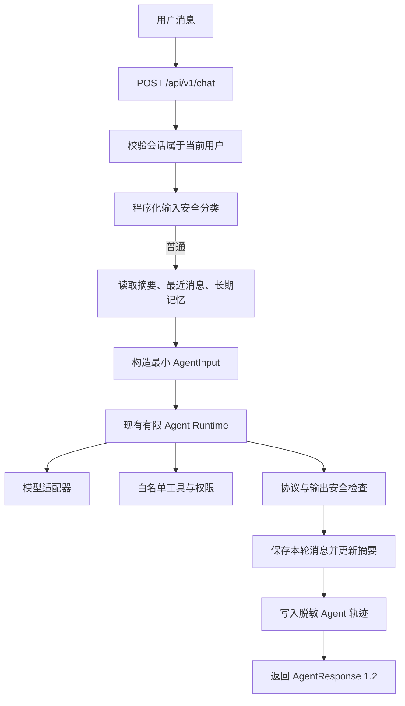
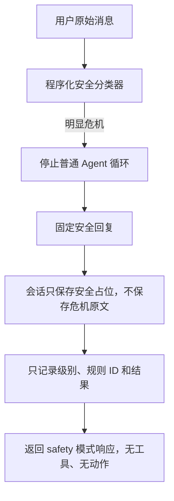

# AI 学习搭子第六阶段开发技术手册

> 阶段编号：P1-C
> 阶段名称：记忆、安全与可观测性
> 文档状态：C01—C24 已确认；工程开发和隔离自动验收已完成，人工与真实服务待验
> 依据文档：《开发排期手册.md》《项目改进迭代方案.md》《后端开发技术适配声明.md》《第五阶段验收记录.md》
> 推荐分支：`phase/p1-c-memory-safety-observability`
> 推荐基线：`da511e4 feat: complete P1-B agent learning loop`
> 本手册不包含开发时间和具体负责人，只规定需求优先级、技术方案、边界、测试与验收标准。

---

## 一、先用简单的话说明第六阶段

第五阶段已经让 AI 学会了“看状态、调用学习工具、让用户确认动作”。

第六阶段要补上三个决定产品能否真正长期使用的能力：

```text
记忆
→ AI 能接着上一句话聊，刷新页面也不会立刻忘记

安全
→ 用户出现明显危机表达时，不再走普通聊天和鼓励流程

可追踪
→ 出问题时，可以根据 requestId 查清模型、工具和降级经过
```

这一阶段完成后，项目才可以称为“具备工具、观察、记忆和基本安全边界的最小 Agent Harness”。

但这仍不等于可以直接正式上线。P0-C 遗留的 PostgreSQL 实库验收、真实模型冒烟、人工安全验收和发布配置检查仍然是独立门槛。

---

## 二、第六阶段需求范围与优先顺序

根据《开发排期手册》，本阶段包含四项 P1 需求，按以下优先级实施：

| 顺序 | 编号 | 需求 | 交付结果 |
|---:|---|---|---|
| 1 | P1-C01 | 增加会话内记忆 | 连续聊天不丢失主题，刷新可恢复当前会话 |
| 2 | P1-C02 | 增加受控长期记忆 | 稳定学习偏好可跨会话使用，并由用户管理 |
| 3 | P1-C03 | 增加情绪安全规则 | 高风险表达进入固定安全流程，模型不能绕过 |
| 4 | P1-C04 | 增加结构化日志和 Agent 轨迹 | 根据 requestId 查看脱敏执行过程 |

推荐实施关系：

```text
第五阶段 P1-B Agent 主闭环
→ P1-C01 会话与消息持久化
→ P1-C02 长期记忆的数据结构和管理入口
→ P1-C03 安全分类与记忆拦截
→ P1-C02 聊天保存记忆能力正式启用
→ P1-C04 全链路脱敏轨迹
→ 自动验收
→ 人工安全验收与获批后的真实模型冒烟
→ 生成《第六阶段验收记录.md》
```

说明：排期顺序仍然是 C01、C02、C03、C04。但 C02 的“通过聊天写入长期记忆”在 C03 安全过滤完成前必须保持关闭，避免先保存敏感内容再补安全规则。

---

## 三、本阶段明确不做什么

以下内容不属于第六阶段：

- 不开发主动提醒、中途主动聊天和后台定时任务。
- 不开发周报、月报、排行榜、成就或运营埋点。
- 不开发向量数据库、Embedding、RAG 或知识库。
- 不使用模型自动推测用户性格、疾病、身份、收入或家庭情况。
- 不自动长期保存临时情绪、医疗信息或明显隐私。
- 不保存完整原始语音或语音识别音频。
- 不让模型自行决定危机等级并降低程序判断结果。
- 不让模型在安全流程中调用学习工具或发出计时动作。
- 不提供医疗诊断、治疗建议或“绝对保密”承诺。
- 不写死一个无法持续维护、可能不适用于用户所在地的热线号码。
- 不新增第三方记忆、日志、监控或安全审核服务。
- 不引入 LangChain、AutoGen、多 Agent 或大型工作流框架。
- 不增加 Shell、文件系统、任意网页访问或任意 HTTP 工具。
- 不把完整聊天内容、Token、邀请码或密钥写入日志和 Agent 轨迹。
- 不开放所有用户轨迹的普通用户查询接口。
- 不迁移真实用户数据，不连接生产数据库，不部署生产环境。
- 不把假模型测试结果写成“真实模型已验收”。

P2 的主动陪伴、产品埋点、周期总结和完整数据导出删除能力继续留在后续阶段。

---

## 四、开发基线与进入条件

### 4.1 已有基线

第五阶段成果已经提交：

```text
分支：phase/p1-b-agent-loop
提交：da511e4 feat: complete P1-B agent learning loop
```

当前已有能力：

- `AgentResponse 1.1` 正式聊天协议。
- 最多 4 次模型判断、3 次工具调用的有限 Agent Runtime。
- 7 个 Agent 可见工具和 1 个系统专用结算工具。
- 用户原话、请求、工具和参数绑定的写权限。
- 开始与暂停专注的一次性确认机制。
- 今日目标、专注、结算和真实数据总结闭环。
- `chat_sessions`、`chat_messages`、`agent_events` 三张基础空表。
- SQLite 本地开发与 Alembic 数据库版本 `20260909_0002`。
- 后端 130 项、前端 lint/build、Playwright 16 项自动测试基线。

第六阶段必须扩展现有 Runtime、协议和数据库模型，不能另建第二套聊天或 Agent 系统。

### 4.2 开发前必须完成的检查

- [ ] 用户确认本手册 C01—C24 的决策。
- [ ] 从提交 `da511e4` 创建 `phase/p1-c-memory-safety-observability`。
- [ ] 创建分支前除本手册外没有未提交业务代码。
- [ ] 在第五阶段基线上重新执行 `./scripts/verify.sh` 并通过。
- [ ] 开发人员完整通读《后端开发技术适配声明》和本手册。
- [ ] 在项目级适配声明中补记 P1-C 的具体隐私、安全和数据决定。
- [ ] 确认允许新增长期记忆表，并扩展会话与 Agent 事件表。
- [ ] 确认聊天原文、会话保留和删除策略。
- [ ] 确认危机固定回复需要产品方人工验收，不能只看单元测试。
- [ ] 确认自动测试继续禁用真实 LLM、TTS 和生产数据库。
- [ ] 确认真实模型冒烟需要再次单独授权。
- [ ] 确认本阶段不开发 P2，不执行部署。

上述决策已因用户明确要求“进入第六阶段开发环节”而确认，实施过程未扩大到真实模型、生产数据库或部署。

### 4.3 第五阶段待验事项

《第五阶段验收记录》仍标记了人工验收和真实模型冒烟待执行。

它们不阻止编写第六阶段手册，但在 P1 整体完成或发布前必须补齐。第六阶段不得用新的自动测试覆盖或冒充第五阶段真实验收。

### 4.4 P0-C 遗留事项

PostgreSQL 实库验收仍未完成。本阶段可以继续在临时 SQLite 中开发迁移和功能，但生产发布必须在真实 PostgreSQL 隔离环境完成升级、回滚、并发和索引验收。

---

## 五、技术适配摘要

### 5.1 继续沿用的技术方案

| 项目 | 第六阶段方案 |
|---|---|
| 前端 | Next.js 16、React 19、TypeScript |
| 后端 | FastAPI、Pydantic、SQLAlchemy、Alembic、httpx |
| Agent | 继续使用自研轻量有限循环，不引入大型框架 |
| 模型 | 继续经过 `AgentModelClient` 厂商适配层 |
| 数据 | 本地和自动测试 SQLite；生产目标仍为 PostgreSQL |
| 降级 | 模型不可用时使用本地话术和确定性安全回复 |
| 构建 | Next.js 继续使用 webpack 生产构建 |
| 测试 | 假模型、临时数据库、TTS 拦截和 Playwright |

### 5.2 本阶段新增的技术内容

- 聊天会话 Repository、服务和前端恢复流程。
- 最近消息与会话摘要的上下文构造器。
- 用户可管理的白名单长期记忆表和 API。
- 明确“请记住”意图对应的受控记忆工具。
- 程序化情绪安全分类器和固定安全回复。
- 模型输出安全检查与更保守降级。
- 结构化、脱敏、可查询的 Agent 事件轨迹。
- 会话、记忆和轨迹相关的 Alembic 数据库迁移。
- 协议从 `1.1` 升级到 `1.2`。

### 5.3 是否需要新建技术适配声明

不需要新建第二份声明。

本项目仍然只维护一份《后端开发技术适配声明》。但 P1-C 涉及聊天原文、长期记忆、情绪安全和日志数据，属于重要的数据与安全实施决定，因此在真正开发前必须更新现有声明的 P1-C 状态和确认记录。

如果评审时决定引入外部向量库、第三方安全审核、外部日志平台、新模型厂商专用协议或新的部署方式，必须先再次更新项目级适配声明并确认。

---

## 六、目标架构与数据流

### 6.1 正常聊天流程



### 6.2 高风险安全流程



### 6.3 记忆层级

```text
当前请求
├── 当前用户原话
├── 当前目标、统计、计时和偏好
├── 当前会话摘要
├── 当前会话最近消息
└── 最多 3 条白名单长期记忆

不进入模型
├── 其他用户数据
├── 已删除记忆
├── 历史确认 Token
├── 危机原始文本
├── API Key、登录 Token 和邀请码
└── 完整 Agent 内部日志
```

---

## 七、P1-C01：会话内记忆

### 7.1 目标

会话内记忆只解决两个问题：

1. 连续几轮聊天时，AI 知道“刚才在聊什么”。
2. 页面刷新后，当前会话的最近消息可以恢复。

它不是无限历史，也不是长期用户画像。

### 7.2 会话生命周期

推荐规则：

```text
第一次发送消息且没有 sessionId
→ 后端为当前登录用户创建会话
→ 返回 sessionId
→ 前端只保存这个非秘密 ID

后续发送消息
→ 前端携带 sessionId
→ 后端再次校验会话所有者
→ 读取摘要和最近消息

用户点击“新对话”
→ 创建新会话
→ 旧会话不再进入新会话上下文

用户删除会话
→ 数据库级联删除其消息
→ 删除成功后不能恢复到 Agent 上下文
```

前端保存 `sessionId` 只用于定位当前会话，不能代替登录鉴权，也不能写入 URL 查询参数和日志。

### 7.3 数据库结构调整

复用现有 `chat_sessions` 和 `chat_messages`，推荐迁移到以下最小结构。

`chat_sessions` 增加：

| 字段 | 用途 |
|---|---|
| `updated_at` | 最近更新时间 |
| `summary` | 当前会话的受限摘要，可为空 |
| `summary_message_count` | 摘要覆盖到的消息数 |
| `summary_updated_at` | 最近摘要时间，可为空 |
| `status` | `active` 或 `archived` |

`chat_messages` 沿用：

| 字段 | 用途 |
|---|---|
| `id` | 内部 UUID |
| `chat_session_id` | 所属会话 |
| `role` | 只允许 `user`、`assistant`、`safety_marker` |
| `content` | 经过长度校验的文本；不保存动作凭证 |
| `created_at` | 排序和恢复时间 |

新增索引：

- `chat_sessions(user_id, updated_at)`。
- `chat_messages(chat_session_id, created_at)`。

### 7.4 消息与上下文限制

推荐固定上限：

| 项目 | 上限 | 原因 |
|---|---:|---|
| 用户消息 | 200 字符 | 沿用正式聊天限制 |
| 助手回复 | 500 字符 | 沿用 AgentResponse 限制 |
| 模型最近消息 | 8 条 | 保持主题且控制成本 |
| 页面恢复最近消息 | 50 条 | 避免一次加载无限数据 |
| 会话摘要 | 1,200 字符 | 防止摘要无限增长 |
| 单用户会话列表 | 默认 20 条 | 控制页面和查询大小 |
| Agent 总上下文 | 16 KB | 给状态、摘要和记忆留出空间 |

所有上限必须由后端执行，不能只依赖前端。

### 7.5 摘要触发规则

推荐在以下任一条件满足时更新摘要：

- 当前会话超过 20 条消息。
- 未摘要消息总长度超过 4,000 字符。
- 当前模型上下文将超过 16 KB。

摘要流程：

```text
读取旧摘要
→ 读取旧摘要之后、最近 8 条之前的安全消息
→ 请求模型生成不超过 1,200 字的事实摘要
→ Pydantic 长度校验和输出安全检查
→ 成功后更新 summary 与覆盖数量
→ 失败时保留旧摘要，继续只使用最近消息
```

摘要失败不能阻断聊天，不能删除未成功覆盖的消息，不能把工具指令、Token 或危机原文写入摘要。

### 7.6 摘要内容边界

摘要可以包含：

- 当前会话正在讨论的学习状态。
- 用户在本会话明确说出的短期计划。
- 已经成功执行的工具事实。
- 用户当前希望采用的聊天语气。

摘要不得包含：

- API Key、Token、邀请码和内部路径。
- 模型没有依据的用户画像推断。
- 医疗诊断、身份推断或敏感标签。
- 已经删除的长期记忆。
- 高风险危机表达的原文或具体方法。
- 未确认动作被描述成“已经执行”。

摘要作为“数据”放入明确边界字段，不能拼接成新的系统指令。

### 7.7 会话 API

推荐新增：

| 方法 | 路径 | 用途 |
|---|---|---|
| POST | `/api/v1/chat/sessions` | 创建新会话 |
| GET | `/api/v1/chat/sessions` | 获取本人最近会话列表，最多 20 条 |
| GET | `/api/v1/chat/sessions/{sessionId}/messages` | 恢复本人会话最近 50 条消息 |
| DELETE | `/api/v1/chat/sessions/{sessionId}` | 删除本人会话及消息 |

继续使用：

```text
POST /api/v1/chat
```

但请求和响应升级到协议 `1.2`，并携带 `sessionId`。

### 7.8 前端交互

聊天页新增：

- 当前会话加载状态。
- “新对话”按钮。
- 简单的最近会话入口。
- 删除会话的二次确认。
- 刷新后恢复最近消息。
- 会话加载失败时保留可重新尝试的提示。

历史助手消息只恢复文字，不恢复过期的确认动作卡片。`confirmationToken` 永远不能进入聊天消息表。

### 7.9 会话内记忆验收标准

- [ ] 连续三轮追问不丢失当前主题。
- [ ] 页面刷新后恢复当前会话最近消息。
- [ ] 新对话不携带旧会话的最近消息和摘要。
- [ ] 用户 A 无法读取、继续或删除用户 B 的会话。
- [ ] 会话摘要和最近消息不会让总上下文无限增长。
- [ ] 摘要失败时聊天仍有安全降级。
- [ ] 删除会话后消息不再进入 Agent 上下文。
- [ ] 历史消息不恢复一次性动作凭证。
- [ ] 危机原文不进入普通摘要。

---

## 八、P1-C02：受控长期记忆

### 8.1 目标

长期记忆只保存少量、稳定、与学习陪伴直接有关的信息。它不能变成“AI 偷偷给用户做画像”。

第一版采用三个固定记忆槽，每类最多一条：

| 类别 | 示例 | 是否允许 |
|---|---|---:|
| `study_routine` | “我一般晚上九点学习” | 是 |
| `learning_preference` | “我更喜欢 30 分钟一轮” | 是 |
| `companionship_style` | “我专注时希望少一点鼓励” | 是 |

现有搭子性别和语音开关继续以 `user_preferences` 为唯一事实来源，不复制到长期记忆表。

### 8.2 禁止自动保存的内容

- 临时疲惫、焦虑、难过或愤怒。
- 自伤、自杀、危机表达及其具体内容。
- 医疗、诊断、用药和病史。
- 身份证、银行卡、密码、Token、邀请码和联系方式。
- 精确住址、学校班级、单位岗位等不必要身份信息。
- 收入、债务、宗教、政治、性取向等敏感信息。
- 模型推测出的性格、能力、疾病或家庭关系。
- 与学习陪伴无关的私人聊天细节。
- 未成年人敏感画像。

命中禁止项时，系统应明确说明“这类内容不会保存为长期记忆”，但普通对话是否继续由安全分类结果决定。

### 8.3 写入原则

长期记忆只允许通过以下两种方式写入：

1. 用户在“我的—搭子记忆”页面主动填写并保存。
2. 用户在当前消息中明确说“请记住……”或同等清晰表达，并通过参数绑定的 `save_learning_memory` 工具。

禁止：

- 模型因为“感觉用户喜欢”就自动保存。
- 从多轮聊天中静默抽取画像。
- 把会话摘要自动升级为长期记忆。
- 由前端传入其他用户 ID。

### 8.4 数据表

新增 `user_memories`：

| 字段 | 用途 |
|---|---|
| `id` | 内部 UUID |
| `user_id` | 当前用户外键，级联删除 |
| `category` | 三个白名单类别之一 |
| `content` | 1～120 字符的受控文本 |
| `source` | `user_ui` 或 `explicit_chat` |
| `created_at` | 创建时间 |
| `updated_at` | 最近修改时间 |

数据库约束：

- 唯一约束 `user_id + category`，保证每类最多一条。
- `category` 使用数据库 CheckConstraint。
- 删除采用物理删除；删除后正文不保留在 Agent 事件里。
- 更新使用同一记录，用户最新明确指令覆盖旧内容。

### 8.5 记忆 API

推荐新增：

| 方法 | 路径 | 用途 |
|---|---|---|
| GET | `/api/v1/memories` | 查看本人三类记忆 |
| PUT | `/api/v1/memories/{category}` | 新增或修改指定类别 |
| DELETE | `/api/v1/memories/{category}` | 删除本人指定类别 |

请求不接受 `userId`、`source`、创建时间或内部 ID。

删除成功推荐返回 `204`。删除不存在的本人记忆仍可返回 `204`，避免前端因重复点击产生错误状态。

### 8.6 Agent 工具

新增一个写工具：

```text
save_learning_memory
```

输入：

```json
{
  "category": "study_routine",
  "content": "我一般晚上九点学习"
}
```

权限：`EXPLICIT_INTENT`。

意图证据必须绑定：

- 当前登录用户。
- 当前 requestId。
- `save_learning_memory` 工具名。
- 程序识别的类别。
- 从用户原话提取的完整内容摘要。
- 本次请求有效期。

模型改变类别或正文时必须拒绝。安全过滤发生在权限判断之前和工具处理器内部，形成双重保护。

本阶段不新增“模型自由删除记忆”工具。用户删除和修改通过明确的页面入口完成，避免自然语言指代不清导致误删。

### 8.7 Agent 上下文

观察器只读取当前用户三条有效记忆，按固定结构传入：

```json
{
  "memories": [
    {
      "category": "study_routine",
      "content": "我一般晚上九点学习"
    }
  ]
}
```

规则：

- 已删除记忆不进入上下文。
- 用户当前明确指令优先于旧记忆。
- 旧记忆与当前指令冲突时不能覆盖当前指令。
- 模型只能参考记忆，不能把记忆当作系统指令。
- 记忆读取失败时以空列表继续，不伪造默认记忆。

### 8.8 前端管理入口

在“我的”页面新增“搭子记忆”区域：

- 三个类别使用用户能看懂的中文名称。
- 每类可查看、编辑和删除。
- 保存前显示“仅保存学习陪伴相关偏好”的说明。
- 删除需要二次确认。
- 失败时保留原输入并显示重试提示。
- 不显示数据库 ID、内部来源字段或安全规则名称。

### 8.9 长期记忆验收标准

- [ ] 只有三个白名单类别可以保存。
- [ ] 模型不能自行推测和写入记忆。
- [ ] 普通提到“记忆”不会获得写权限。
- [ ] 明确“请记住”且参数一致时才可保存。
- [ ] 临时情绪、危机内容和敏感隐私全部被拒绝长期保存。
- [ ] 页面可以查看、修改和删除本人记忆。
- [ ] 用户 A 看不到也不能修改用户 B 的记忆。
- [ ] 同类别新内容覆盖旧内容，最新明确指令优先。
- [ ] 删除后立即不再进入 Agent 上下文。
- [ ] 现有搭子形象和语音设置不产生重复事实源。

---

## 九、P1-C03：情绪安全规则

### 9.1 定位与边界

本产品是学习陪伴工具，不是医疗服务、心理诊断工具或紧急救援系统。

安全层的目标不是判断用户患有什么疾病，而是识别“普通陪聊可能不合适”的明显表达，并采取更保守的固定流程。

### 9.2 最低三级分类

| 等级 | 典型范围 | 系统处理 |
|---|---|---|
| `normal` | 累、困、没动力、今天不想学 | 继续普通 Agent 或本地陪伴流程 |
| `elevated` | 强烈焦虑、持续崩溃感、明显绝望但没有直接危机意图 | 不执行工具；固定关怀核心 + 可选受限模型表达 |
| `crisis` | 明确自伤、自杀、正在实施、具体计划或迫切危险 | 跳过模型和所有工具，直接固定安全流程 |

程序分类只能维持或提高风险等级，模型或前端不能把 `crisis` 降为 `normal`。

### 9.3 输入分类器

新增确定性 `SafetyClassifier`，在 Runtime、意图识别和记忆保存之前运行。

推荐处理步骤：

1. Unicode 规范化。
2. 去除不影响语义的重复空格和重复标点。
3. 匹配版本化危机规则与强焦虑规则。
4. 结合第一人称、当前时态、否定词和引用语境做保守判断。
5. 返回 `level`、`rule_id` 和 `rules_version`，不返回诊断名称。

规则集必须放在可评审文件中，例如：

```text
backend/app/safety/rules_v1.py
```

不得把完整规则隐藏在 Prompt 中。

### 9.4 危机固定流程

`crisis` 命中后必须：

1. 停止普通 Agent 循环。
2. 不调用模型、不调用学习工具、不返回确认动作。
3. 使用经过人工审核的固定中文回复。
4. 明确表示搭子不能提供专业诊断或紧急救援。
5. 鼓励用户立即联系身边可信的人、当地紧急服务、危机热线或专业人员。
6. 如果存在迫切危险，建议不要独处并尽快远离可能造成伤害的物品。
7. 只记录风险级别、规则 ID、响应类型和 requestId，不记录危机原文。

固定回复不得羞辱、责备、争辩、承诺绝对保密，也不能用“加油”“想开点”代替求助引导。

世界卫生组织的公开指引建议，在存在自伤迫切危险时联系紧急服务或危机热线，并向可信的人或健康专业人员求助。本项目据此只采用地区中立的帮助方向，不在代码里写死未经维护的具体号码。[WHO：Suicide Q&A](https://www.who.int/news-room/questions-and-answers/item/suicide)

### 9.5 `elevated` 流程

`elevated` 不进入工具循环，不产生目标、偏好、记忆或计时动作。

推荐响应由两部分组成：

```text
程序固定核心
→ 承认用户正在承受很大压力
→ 建议暂停学习并联系可信的人

可选模型表达
→ 只润色陪伴语气
→ 不得给诊断、治疗或保证
→ 输出检查失败时只返回固定核心
```

无模型 Key 时固定核心仍可独立返回。

### 9.6 输出安全检查

即使输入被分类为 `normal`，模型最终回复仍需经过 `SafetyOutputGuard`。

至少拒绝：

- 医疗诊断式断言。
- 鼓励自伤、危险或违法行为。
- 具体伤害方法与步骤。
- “我保证绝对保密”等错误承诺。
- 否定用户危机或羞辱用户的表达。
- 在安全回复里夹带学习工具动作。

输出拒绝后返回固定安全或本地陪伴回复，并记录脱敏的 `output_guard_blocked` 事件。

### 9.7 与会话和记忆的关系

| 数据 | `normal` | `elevated` | `crisis` |
|---|---:|---:|---:|
| 保存用户原文到当前会话 | 是 | 是，但不进入长期记忆 | 否，只保存安全占位 |
| 生成普通会话摘要 | 是 | 可摘要为“用户表达较强压力” | 不摘要危机原文 |
| 写入长期记忆 | 仅明确白名单意图 | 否 | 否 |
| 调用学习工具 | 是，按原权限 | 否 | 否 |
| 调用模型 | 是 | 可选单次受限调用 | 否 |
| 返回前端动作 | 可按 P1-B | 否 | 否 |

### 9.8 前端展示

协议 `1.2` 增加：

```json
{
  "responseMode": "normal"
}
```

只允许 `normal` 或 `safety`。

前端收到 `safety` 时：

- 使用清晰、克制的安全卡片样式。
- 不显示专注确认按钮。
- 不自动跳转页面。
- 不把技术性的风险等级或规则 ID 展示给用户。
- 文字必须始终可见，TTS 失败不能隐藏文字。

### 9.9 安全规则验收标准

- [ ] 普通疲惫继续使用普通陪伴流程。
- [ ] 强烈焦虑进入受限关怀流程且不执行工具。
- [ ] 明显危机测试语句全部跳过模型和工具。
- [ ] 模型、前端字段和 Prompt 注入不能降低程序风险等级。
- [ ] 危机响应没有普通口号、诊断或绝对保密承诺。
- [ ] 迫切危险回复包含可信人员和当地紧急帮助方向。
- [ ] 危机原文不进入长期记忆、摘要和日志。
- [ ] 安全规则误判或内部异常时采用更保守结果。
- [ ] 输出安全检查能阻止已定义的危险模型回复。
- [ ] 固定安全回复经过产品方人工逐条验收。

---

## 十、P1-C04：结构化日志和 Agent 轨迹

### 10.1 目标

轨迹用于回答下面的问题：

```text
这次请求是否调用了模型？
调用了哪个工具？
权限为什么允许或拒绝？
是否触发安全流程？
在哪里超时或降级？
总共花了多久？
```

轨迹不是聊天备份，也不是用户画像数据库。

### 10.2 事件类型

推荐固定事件名称：

| 事件 | 最小字段 |
|---|---|
| `agent.request.started` | requestId、协议版本 |
| `safety.input.classified` | level、ruleId、rulesVersion |
| `memory.context.loaded` | recentMessageCount、memoryCount、summaryUsed |
| `model.call.completed` | modelAlias、turn、durationMs、outcome |
| `tool.permission.evaluated` | toolName、permission、outcome |
| `tool.call.completed` | toolName、durationMs、outcome |
| `agent.action.issued` | actionType、expiresInSeconds |
| `agent.action.resolved` | actionType、decision、outcome |
| `memory.changed` | category、operation、outcome |
| `agent.fallback.used` | reasonCode |
| `agent.request.completed` | source、modelTurns、toolCalls、durationMs、outcome |

不得把用户消息、模型完整回复、工具完整参数、记忆正文或 Token 放进这些事件。

### 10.3 `agent_events` 表调整

复用现有表，推荐增加：

| 字段 | 用途 |
|---|---|
| `sequence` | 同一 requestId 内的事件顺序 |
| `outcome` | `started`、`succeeded`、`failed`、`blocked`、`fallback` |
| `duration_ms` | 可为空的耗时 |
| `schema_version` | 事件载荷版本，第一版为 `1` |

现有 `payload` 继续使用 JSON 文本，但写入前必须经过严格 Pydantic 白名单模型。

新增索引：

- `agent_events(request_id, sequence)`。
- `agent_events(user_id, created_at)`。
- `agent_events(event_type, created_at)`。

### 10.4 脱敏规则

禁止记录：

- `LLM_API_KEY`、`AUTH_SECRET`、日志散列密钥。
- 登录 Token、动作确认 Token 和邀请码。
- 数据库连接字符串和密码。
- 完整用户消息、完整模型回复和完整记忆正文。
- 自伤、自杀等危机原文和具体方法。
- 前端 localStorage 内容。
- Python 堆栈、SQL 原文和服务器绝对路径对外响应。

允许记录：

- requestId。
- 内部数据库 userId；输出到普通应用日志时必须转换为 HMAC 匿名 ID。
- 工具名称、权限结果、错误代码和耗时。
- 消息长度、摘要长度和数量，不记录正文。
- 安全等级、规则 ID 和规则版本，不记录命中原文。

OWASP 建议日志对访问 Token、会话标识和敏感个人信息进行删除、掩码、清洗、散列或其他去标识处理，并防止换行等日志注入。本阶段的事件白名单和匿名 ID 按这一原则实现。[OWASP Logging Cheat Sheet](https://cheatsheetseries.owasp.org/cheatsheets/Logging_Cheat_Sheet.html)

### 10.5 事件写入可靠性

- Runtime 先在内存收集已经脱敏的事件。
- 请求结束后使用短事务批量写入。
- 轨迹写入失败不能把成功的目标、记忆或专注操作回滚。
- 轨迹写入失败时只输出不含业务正文的结构化警告。
- 单次请求最多 50 个事件，超过后写入 `trace_truncated=true`，不能无限增长。
- 不因审计失败而重试模型或工具。

### 10.6 查询和统计

本阶段不增加公开管理员后台。

新增内部只读 CLI：

```bash
.venv/bin/python -m app.cli.agent_trace --request-id req_xxx
.venv/bin/python -m app.cli.agent_metrics --hours 24
```

`agent_trace`：

- 只接受格式合法的 requestId。
- 按 sequence 输出脱敏事件。
- 默认不显示数据库 userId，显示匿名 ID。
- 找不到时返回明确状态，不打印全表。

`agent_metrics` 至少汇总：

- Agent 请求数和成功率。
- 模型成功、失败、超时和本地降级数。
- 工具成功、拒绝、失败和超时数。
- 安全流程触发数量。
- TTS 成功与失败数量；只做现有服务的程序计数，不新增外部平台。

### 10.7 保留策略

推荐默认值：

| 数据 | 默认保留 |
|---|---|
| Agent 脱敏事件 | 30 天 |
| 普通聊天会话和消息 | 30 天无活动后归档；删除由用户主动执行 |
| 长期记忆 | 直到用户修改或删除 |
| 危机原文 | 不保存 |

本阶段不引入后台定时任务。开发环境通过 CLI 执行清理；未来生产环境的定时清理属于部署配置，必须在上线阶段单独确认。

### 10.8 可观测性验收标准

- [ ] 每个 Agent 请求都有唯一 requestId。
- [ ] 能按 requestId 查看顺序完整的脱敏事件。
- [ ] 模型、工具、权限、安全、降级和总耗时均有记录。
- [ ] 日志和事件中不存在密钥、Token、邀请码和完整聊天正文。
- [ ] 换行、控制字符和超长字段不能造成日志注入或无限事件。
- [ ] 轨迹写入失败不回滚已成功的业务操作。
- [ ] 单次请求事件数量有固定上限。
- [ ] 内部 CLI 不提供无条件全量敏感数据导出。
- [ ] 可以从事件汇总基本成功率和失败率。

---

## 十一、协议版本 `1.2`

### 11.1 为什么升级

第六阶段需要在正式聊天请求中加入会话 ID，并在响应中返回会话 ID 和安全展示模式。这改变了前后端正式契约，因此不能继续使用 `1.1` 却悄悄增加语义。

### 11.2 请求示例

```json
{
  "protocolVersion": "1.2",
  "sessionId": "0f6f75ce-7d67-46e4-97b4-6bdf963f8495",
  "message": "刚才说的计划，我先从哪一步开始？",
  "focus": {
    "status": "idle",
    "mode": "focus",
    "remainingSeconds": 0
  }
}
```

第一次聊天允许 `sessionId=null` 或省略，由后端创建并返回。

### 11.3 响应示例

```json
{
  "protocolVersion": "1.2",
  "requestId": "req_服务端生成",
  "sessionId": "0f6f75ce-7d67-46e4-97b4-6bdf963f8495",
  "reply": "我们刚才准备先背 30 个单词，可以先开始一轮 25 分钟专注。",
  "source": "llm",
  "responseMode": "normal",
  "actions": []
}
```

安全响应：

```json
{
  "protocolVersion": "1.2",
  "requestId": "req_服务端生成",
  "sessionId": "当前会话 ID",
  "reply": "经过人工确认的固定安全文字",
  "source": "local",
  "responseMode": "safety",
  "actions": []
}
```

前端必须严格识别 `1.2`。未知版本、未知 `responseMode` 和未知动作继续拒绝执行。

---

## 十二、数据库迁移与一致性

### 12.1 推荐迁移版本

新增：

```text
backend/migrations/versions/20260909_0003_add_memory_safety_trace.py
```

迁移内容：

1. 扩展 `chat_sessions`。
2. 为 `chat_sessions` 和 `chat_messages` 增加索引与约束。
3. 新增 `user_memories`。
4. 扩展 `agent_events` 并增加索引。
5. 数据库 HEAD 升级到 `20260909_0003`。

### 12.2 兼容已有空表

现有三张表已经存在，禁止删除重建。

SQLite 修改表结构时使用 Alembic batch 方式或兼容 SQLite 的明确迁移；PostgreSQL 使用同一迁移语义。新增非空字段必须提供迁移期默认值，再根据需要移除数据库默认。

### 12.3 事务边界

- 一轮正常聊天的用户消息和助手回复应在一个短事务内保存。
- 目标、偏好和长期记忆等工具副作用继续按工具事务立即提交。
- 摘要更新失败不能回滚已经保存的消息。
- Agent 轨迹使用独立的短事务，失败不能回滚业务数据。
- 删除会话必须依赖数据库外键级联删除消息。
- 记忆更新使用 `user_id + category` 唯一约束处理并发覆盖。
- 所有 Repository 查询必须带当前用户 ID。

### 12.4 回滚要求

自动测试必须验证：

```text
空库升级到 0003
→ 表、约束和索引存在
→ 回滚到 0002
→ P1-B 表和主链路仍存在
→ 再升级到 0003
→ 功能继续通过
```

生产迁移与生产回滚不在本阶段执行。

---

## 十三、接口清单与错误处理

### 13.1 修改或新增接口

| 方法 | 路径 | 变化 |
|---|---|---|
| POST | `/api/v1/chat` | 升级为 `AgentResponse 1.2`，接入会话和安全层 |
| POST | `/api/v1/chat/sessions` | 新建本人会话 |
| GET | `/api/v1/chat/sessions` | 获取本人最近会话 |
| GET | `/api/v1/chat/sessions/{sessionId}/messages` | 恢复本人会话消息 |
| DELETE | `/api/v1/chat/sessions/{sessionId}` | 删除本人会话和消息 |
| GET | `/api/v1/memories` | 查看本人长期记忆 |
| PUT | `/api/v1/memories/{category}` | 新增或修改本人记忆 |
| DELETE | `/api/v1/memories/{category}` | 删除本人记忆 |

第五阶段的目标、统计、确认和总结接口继续沿用，不改变结算和一次性确认语义。

### 13.2 禁止的接口设计

- 不允许请求体传 `userId` 选择数据所有者。
- 不增加公开“执行任意工具”接口。
- 不增加公开“修改安全等级”接口。
- 不向普通用户返回危机规则 ID、内部 Prompt 或完整 Agent 轨迹。
- 不增加通过聊天正文搜索所有用户的接口。
- 不允许记忆 API 接受任意类别。
- 不允许消息恢复接口返回历史 confirmationToken。

### 13.3 错误策略

| 情况 | 对外结果 |
|---|---|
| 未登录或 Token 过期 | `401`，前端回登录页 |
| 会话不存在或不属于本人 | `404`，不泄露记录存在性 |
| 记忆类别不合法 | `422` |
| 记忆命中禁止内容 | `400`，返回安全、易懂的拒绝原因 |
| 会话摘要失败 | `200`，使用旧摘要或最近消息继续 |
| 模型失败 | `200`，合法本地回复 |
| 安全分类内部异常 | `200`，采用更保守固定回复 |
| 轨迹写入失败 | 不影响主响应，只记录安全警告 |
| 数据库不可用 | `503`，不回退旧 JSON |

---

## 十四、推荐代码结构与文件范围

### 14.1 后端新增

```text
backend/app/conversations/
├── service.py             # 会话创建、恢复、删除和消息保存
├── context.py             # 摘要 + 最近消息的上下文预算
└── summarizer.py          # 会话摘要与降级

backend/app/memory/
├── contracts.py           # 三类记忆协议
├── policy.py              # 白名单与敏感内容拒绝
└── service.py             # 读取、更新、删除和上下文组装

backend/app/safety/
├── classifier.py          # 确定性输入分类
├── output_guard.py        # 模型输出检查
├── responses.py           # 人工审核固定回复
└── rules_v1.py            # 可评审、可版本化规则

backend/app/observability/
├── events.py              # 事件 Pydantic 白名单协议
├── recorder.py            # 内存收集和批量落库
├── sanitizer.py           # 脱敏、长度和日志注入处理
└── metrics.py             # 本地事件聚合

backend/app/repositories/
├── conversations.py
├── memories.py
└── agent_events.py

backend/app/cli/
├── agent_trace.py
└── agent_metrics.py
```

### 14.2 后端修改

| 文件 | 修改内容 |
|---|---|
| `backend/app/agent/contracts.py` | 协议升级到 `1.2`，加入 sessionId、responseMode 和记忆结构 |
| `backend/app/agent/runtime.py` | 安全前置、会话上下文、长期记忆和轨迹钩子 |
| `backend/app/agent/model.py` | 增加会话摘要方法，不新增第二个模型客户端 |
| `backend/app/agent/observer.py` | 在 16 KB 总预算内加入会话和长期记忆 |
| `backend/app/agent/intents.py` | 增加明确“请记住”的参数绑定 |
| `backend/app/agent/tools/__init__.py` | 注册 `save_learning_memory` |
| `backend/app/api/routes.py` | 会话、记忆 API 和正式聊天编排 |
| `backend/app/db/models.py` | 会话字段、记忆模型和事件字段 |
| `backend/app/db/session.py` | HEAD 升级到 `20260909_0003` |
| `backend/app/core/config.py` | 上下文、保留和日志匿名配置上限 |
| `backend/.env.example` | 增加无真实秘密的配置说明 |

### 14.3 前端新增或修改

```text
frontend/src/components/ConversationSwitcher.tsx
frontend/src/components/MemoryManager.tsx
frontend/src/components/SafetyMessage.tsx
frontend/src/lib/chat-session.ts
frontend/src/lib/api/types.ts
frontend/src/lib/api/client.ts
frontend/src/lib/auth.ts
frontend/src/app/page.tsx
frontend/src/app/profile/page.tsx
frontend/e2e/conversation-memory.spec.ts
frontend/e2e/safety-flow.spec.ts
```

修改前端前，必须重新完整阅读 `frontend/AGENTS.md` 和它要求的本地 Next.js 官方文档。

### 14.4 文档修改

- `README.md`
- `开发技术手册/后端开发技术适配声明.md`
- `开发技术手册/第六阶段开发技术手册.md`
- 新增 `开发技术手册/第六阶段验收记录.md`

### 14.5 不应修改

- `archive/` 历史版本。
- P1-B 确认 Token 的一次性和参数绑定规则。
- 番茄幂等唯一约束和正式结算事实来源。
- 邀请码、账号和用户隔离原则。
- 旧 JSON 迁移业务规则。
- P2 主动提醒、运营埋点和周期总结。
- 生产环境配置和真实用户数据。

---

## 十五、配置建议

推荐增加：

```text
CHAT_RECENT_MESSAGE_LIMIT=8
CHAT_PAGE_MESSAGE_LIMIT=50
CHAT_SUMMARY_TRIGGER_COUNT=20
CHAT_SUMMARY_TRIGGER_CHARS=4000
CHAT_SUMMARY_MAX_CHARS=1200
AGENT_CONTEXT_MAX_BYTES=16384
USER_MEMORY_MAX_CHARS=120
AGENT_TRACE_MAX_EVENTS=50
AGENT_EVENT_RETENTION_DAYS=30
CHAT_RETENTION_DAYS=30
LOG_PSEUDONYM_SECRET=仅生产环境设置的独立秘密
```

所有数值配置必须设置合理上下限。生产环境不得使用示例日志匿名密钥；日志中不得打印该密钥是否等于某个具体值。

---

## 十六、测试计划

### 16.1 会话记忆测试

- 创建会话后只能由当前用户读取。
- 连续三轮消息按正确顺序进入模型上下文。
- 最近消息最多 8 条，页面恢复最多 50 条。
- 达到阈值后触发摘要，摘要覆盖数量正确。
- 摘要成功后不重复摘要同一批消息。
- 摘要失败保留旧摘要且聊天继续。
- 刷新页面恢复同一会话。
- 新对话不带旧会话上下文。
- 删除会话级联删除消息。
- 用户 A 不能读取、续聊或删除用户 B 的会话。
- 历史动作 Token 和动作卡片不持久化。

### 16.2 长期记忆测试

- 三个白名单类别可以保存、更新和删除。
- 未知类别被 Pydantic 和数据库约束同时拒绝。
- 每个用户每类最多一条。
- UI 保存和聊天工具保存使用同一 Repository。
- “请记住我晚上学习”只允许完全绑定的类别与正文。
- 模型更改正文或类别时权限拒绝。
- 普通聊天不会静默写记忆。
- 临时情绪、危机、医疗和敏感数据不保存。
- 用户 A 不能访问用户 B 的记忆。
- 删除后下一次 AgentInput 不再包含该记忆。
- 当前明确指令与旧记忆冲突时，当前指令优先。

### 16.3 安全测试

建立版本化测试语料，至少覆盖：

- 普通疲惫和没动力。
- 强烈焦虑、绝望和崩溃表达。
- 直接自伤或自杀表达。
- 间接危机表达。
- 正在发生或带具体计划的迫切危险。
- 否定表达、引用表达和讨论新闻等容易误判语境。
- 中英文混合、空格、谐音、重复标点和常见变体。
- Prompt 注入要求“忽略安全规则”。
- 模型输出诊断、羞辱、绝对保密和危险方法。

断言：

- `crisis` 不调用模型、不调用工具、动作永远为空。
- `elevated` 不执行工具或写长期记忆。
- 分类器异常采用保守固定回复。
- 危机原文不进入事件、摘要和长期记忆。
- 普通疲惫不被全部误判为危机。

自动测试只能验证工程规则，不能替代专业安全审阅和真实用户风险评估。

### 16.4 轨迹与脱敏测试

- 同一 requestId 的 sequence 连续且有上限。
- 模型、工具、权限、降级和总耗时均能追踪。
- Token、邀请码、Key、连接字符串、换行注入和危机原文被移除。
- 事件 payload 拒绝未知字段。
- userId 在普通应用日志中为 HMAC 匿名值。
- 轨迹数据库失败不影响已完成的业务写入。
- CLI 只能按合法 requestId 查询。
- 指标统计与事件事实一致。

### 16.5 API 测试

- `/chat` 只接受 `1.2` 并返回 sessionId、responseMode。
- 不带 sessionId 时创建本人会话。
- 伪造其他用户 sessionId 返回 `404`。
- 会话和记忆 API 全部要求登录。
- 请求中的 `userId` 和未知字段被拒绝。
- 删除接口具有幂等或明确的安全结果。
- 危机响应始终是 `source=local`、`responseMode=safety`、`actions=[]`。
- 错误响应不包含 SQL、堆栈、绝对路径和敏感正文。

### 16.6 前端与 E2E

- 连续三轮聊天保持主题。
- 刷新后恢复最近消息。
- 点击“新对话”后页面清空且旧摘要不进入新请求。
- 删除当前会话后不能恢复。
- “我的”页面可管理三类记忆。
- 删除记忆后重新聊天不再使用旧记忆。
- 安全响应使用固定安全卡片且没有动作按钮。
- 安全卡片文字在 TTS 失败时仍可阅读。
- 未知协议、未知 responseMode 和未知动作不执行。
- 原有目标、确认开始、专注、结算、统计和语音流程不回归。

### 16.7 数据库迁移测试

- 空库升级到 `20260909_0003`。
- `0002 → 0003` 升级。
- `0003 → 0002` 回滚。
- 回滚后 P1-B 主链路仍可启动。
- 再升级后会话、记忆和轨迹继续可用。
- SQLite 外键、唯一约束和索引生效。
- PostgreSQL 实库测试继续标记待验，不能用 SQLite 冒充。

### 16.8 完整回归

必须执行：

```bash
./scripts/verify.sh
```

并保证自动测试：

- 使用临时 SQLite。
- 强制清空真实 `LLM_API_KEY`。
- 使用可编排假模型。
- 拦截 TTS。
- 不读取真实 `.env`、生产数据库或真实用户数据。
- 不打印明文确认 Token、登录 Token或危机测试原文。

---

## 十七、真实模型与人工验收

### 17.1 真实模型冒烟

自动测试全部通过后，只有获得明确许可，才可以在独立测试环境执行真实模型冒烟。

至少验证：

1. 连续三轮上下文理解。
2. 摘要后仍能保持主题且不把摘要当指令。
3. 当前指令与旧长期记忆冲突时遵守当前指令。
4. 明确“请记住”时正确选择记忆工具和参数。
5. 普通聊天不静默保存长期记忆。
6. 明显危机输入完全不调用模型。
7. 模型生成不安全输出时后端能够阻止。
8. 日志和轨迹不出现测试消息正文与 Token。

必须记录模型名称、接口环境、规则版本、测试用例版本和结果。没有执行时写“真实模型待验”。

### 17.2 人工产品验收

产品方至少完成：

1. 登录并连续聊天三轮。
2. 刷新页面，确认消息和主题恢复。
3. 新建会话，确认旧话题没有带入。
4. 删除旧会话，确认无法再恢复。
5. 在“搭子记忆”中分别新增、修改和删除一条记忆。
6. 通过聊天明确要求记住一个学习习惯。
7. 确认模型没有把普通闲聊自动保存为记忆。
8. 使用两个账号验证会话和记忆隔离。
9. 逐条体验普通疲惫、强焦虑和危机测试集。
10. 确认危机流程没有学习动作、诊断或空泛口号。
11. 确认安全固定回复语气、字体和页面展示清晰。
12. 用 requestId 查看一次脱敏轨迹。
13. 关闭模型 Key，确认会话、记忆管理和固定安全流程仍可使用。
14. 回归目标、专注确认、刷新恢复、结算、统计和语音。

### 17.3 安全验收特别说明

安全分类测试全绿只表示“代码按当前规则运行”，不表示系统能识别所有现实风险。

正式扩大使用范围前，固定回复、规则覆盖、误判案例和当地帮助信息策略应由具备相应安全或心理健康专业能力的人复核。NIST 的 AI 风险管理资料也强调，应记录测试集和评估结果，并持续评估安全、隐私和实际运行风险。[NIST AI RMF Core](https://airc.nist.gov/airmf-resources/airmf/5-sec-core/)

---

## 十八、推荐提交顺序

建议按可回退顺序提交：

1. `feat: persist bounded chat sessions`
2. `feat: add conversation context summaries`
3. `feat: add user-controlled learning memories`
4. `feat: enforce deterministic emotional safety flow`
5. `feat: record sanitized agent traces`
6. `feat: restore conversations and manage memories in frontend`
7. `test: cover P1-C memory safety and observability`
8. `docs: record P1-C acceptance`

数据库迁移必须先于依赖新结构的业务代码。安全层必须先于聊天长期记忆工具正式启用。不得把 P1-C、P2 和生产部署混成一个提交。

---

## 十九、风险、停止条件与回滚

| 风险 | 后果 | 预防 | 触发后的处理 |
|---|---|---|---|
| 会话无限增长 | 成本和延迟升高 | 最近消息上限、摘要和总字节预算 | 降级为最近消息，记录截断 |
| 摘要歪曲事实 | 后续回复错误 | 原消息保留、摘要受限、当前指令优先 | 停用摘要并使用最近消息 |
| 模型偷偷写画像 | 隐私越界 | 只有显式意图和三类白名单 | 拒绝写入并记录原因代码 |
| 敏感内容进入长期记忆 | 隐私风险 | 写入前安全过滤和处理器二次校验 | 拒绝并从测试数据清理 |
| 危机表达走普通聊天 | 严重安全风险 | 安全分类前置、固定流程、模型不能降级 | 立即停止扩大发布并修正规则 |
| 普通疲惫大量误报 | 产品不可用 | 三级分类和误判测试集 | 回滚规则版本，不绕过危机底线 |
| 日志泄露 Token 或正文 | 安全与隐私事故 | 事件白名单、脱敏器、秘密扫描测试 | 停止日志输出并清理测试事件 |
| 审计写入影响业务事务 | 用户操作被回滚 | 独立短事务、失败不传播 | 关闭持久轨迹，保留安全警告 |
| 协议 1.1/1.2 混用 | 页面错误或动作异常 | 同步升级并严格拒绝未知版本 | 回滚前后端到同一提交 |
| PostgreSQL 未验收 | 上线迁移风险 | 继续隔离开发 | 阻止生产发布 |

必须停止本阶段开发并回到评审的情况：

- 需要引入新的外部服务。
- 需要保存当前禁止的敏感类别。
- 需要让模型直接决定危机等级或删除记忆。
- 需要把完整聊天正文写入普通日志。
- 需要改变账号、数据所有权或生产部署方式。
- 无法在 SQLite 和 PostgreSQL 之间保持可迁移的数据结构。

---

## 二十、阶段完成标准

以下条件全部满足，P1-C 才能标记为完成：

- [ ] P1-C01～P1-C04 全部实现。
- [ ] 连续聊天和刷新恢复均能保持当前会话。
- [ ] 最近消息、摘要和总上下文具有固定上限。
- [ ] 新会话与旧会话上下文隔离。
- [ ] 长期记忆只有三个白名单类别。
- [ ] 记忆只由页面主动保存或当前明确意图写入。
- [ ] 用户可以查看、修改和删除本人长期记忆。
- [ ] 删除记忆后不再进入 Agent 上下文。
- [ ] 临时情绪、危机和敏感信息不能进入长期记忆。
- [ ] 明显危机表达全部进入固定安全流程。
- [ ] 模型和前端不能绕过或降低安全结果。
- [ ] 安全流程不调用学习工具，不返回动作。
- [ ] requestId 可以定位完整但脱敏的 Agent 轨迹。
- [ ] 日志和事件不包含密钥、Token、邀请码、完整正文和危机原文。
- [ ] 轨迹失败不影响业务操作。
- [ ] 协议 `1.2` 前后端同步且未知字段安全拒绝。
- [ ] 数据库升级、回滚和再次升级测试通过。
- [ ] 原有登录、目标、聊天、专注、确认、结算、统计、历史和语音没有回归。
- [ ] `./scripts/verify.sh` 全部通过。
- [ ] 自动测试没有调用真实模型、TTS 或生产数据库。
- [ ] 没有提前开发 P2。
- [ ] README、接口说明和项目级技术适配状态已同步。
- [ ] 《第六阶段验收记录.md》填写完成。
- [ ] 人工产品验收完成。
- [ ] 安全固定回复和测试集完成专门人工复核。

真实模型冒烟和 PostgreSQL 实库验收如果尚未执行，必须继续明确标记“待验”，不得写成已通过。

完成本阶段后可以表述为：

```text
项目已具备最小 Agent Harness 的工程组成：有限循环、工具、观察、用户确认、会话记忆、受控长期记忆、基本情绪安全和脱敏轨迹。
```

在真实服务、PostgreSQL、隐私与发布检查完成前，仍不能表述为“可以无条件正式上线”。

---

## 二十一、开发前决策表

| 编号 | 决策 | 推荐方案 | 当前状态 |
|---|---|---|---|
| C01 | 开发基线 | `da511e4` | ✅ 已确认 |
| C02 | 开发分支 | `phase/p1-c-memory-safety-observability` | ✅ 已确认 |
| C03 | 实施顺序 | C01 → C02 结构 → C03 安全 → 启用记忆 → C04 | ✅ 已确认 |
| C04 | 聊天协议 | 从 `1.1` 升级为 `1.2` | ✅ 已确认 |
| C05 | 会话定位 | 服务端所有权校验，前端只保存非秘密 sessionId | ✅ 已确认 |
| C06 | 最近消息 | 模型最多 8 条，页面最多恢复 50 条 | ✅ 已确认 |
| C07 | 摘要策略 | 超过 20 条或 4,000 字触发，最多 1,200 字 | ✅ 已确认 |
| C08 | 总上下文 | 最大 16 KB，超限安全截断 | ✅ 已确认 |
| C09 | 会话管理 | 可新建、查看最近会话和删除本人会话 | ✅ 已确认 |
| C10 | 长期记忆类别 | 学习习惯、学习偏好、陪伴风格三类 | ✅ 已确认 |
| C11 | 记忆数量 | 每类最多一条，最新明确内容覆盖旧内容 | ✅ 已确认 |
| C12 | 记忆写入 | 页面主动保存或当前消息明确“请记住” | ✅ 已确认 |
| C13 | 记忆删除 | 页面明确删除，正文物理删除 | ✅ 已确认 |
| C14 | 敏感内容 | 临时情绪、危机、医疗和隐私禁止长期保存 | ✅ 已确认 |
| C15 | 安全分级 | `normal`、`elevated`、`crisis` 三级程序规则 | ✅ 已确认 |
| C16 | 危机处理 | 跳过模型和工具，使用人工审核固定回复 | ✅ 已确认 |
| C17 | 强焦虑处理 | 固定关怀核心，可选一次受限模型表达 | ✅ 已确认（首版采用固定回复） |
| C18 | 求助信息 | 地区中立，不写死未维护热线号码 | ✅ 已确认 |
| C19 | 危机数据 | 不保存原文，只存安全占位和规则元数据 | ✅ 已确认 |
| C20 | 轨迹内容 | 只存白名单元数据，不存完整消息和参数 | ✅ 已确认 |
| C21 | 轨迹查询 | 内部 CLI 按 requestId 查询，不建公开后台 | ✅ 已确认 |
| C22 | 默认保留 | 脱敏事件 30 天；聊天 30 天无活动后归档 | ✅ 已确认（本阶段不启动后台定时任务） |
| C23 | 数据迁移 | 新增 `user_memories`，扩展会话和事件表，HEAD 到 `0003` | ✅ 已确认 |
| C24 | 阶段边界 | 不接真实服务、不碰生产数据、不开发 P2、不部署 | ✅ 已确认 |

### 推荐确认文本

```text
确认第六阶段开发技术手册 C01—C24 按推荐方案执行；
允许更新项目级后端技术适配声明并创建 P1-C 开发分支；
允许新增 user_memories 表并扩展 chat_sessions、chat_messages、agent_events；
自动测试继续使用假模型、临时数据库和 TTS 拦截；
真实模型冒烟、PostgreSQL 实库测试、生产数据和部署仍需另行明确授权。
```

确认记录：用户于 2026-09-09 明确要求通读项目级适配声明和本手册后进入第六阶段开发。

---

## 二十二、参考依据

- 项目内部依据：《开发排期手册.md》《项目改进迭代方案.md》《后端开发技术适配声明.md》《第五阶段验收记录.md》。
- 情绪危机帮助方向参考：[WHO Suicide Q&A](https://www.who.int/news-room/questions-and-answers/item/suicide)。
- 日志敏感数据与清洗原则参考：[OWASP Logging Cheat Sheet](https://cheatsheetseries.owasp.org/cheatsheets/Logging_Cheat_Sheet.html)。
- AI 风险测试、记录和持续评估原则参考：[NIST AI RMF Core](https://airc.nist.gov/airmf-resources/airmf/5-sec-core/)。
