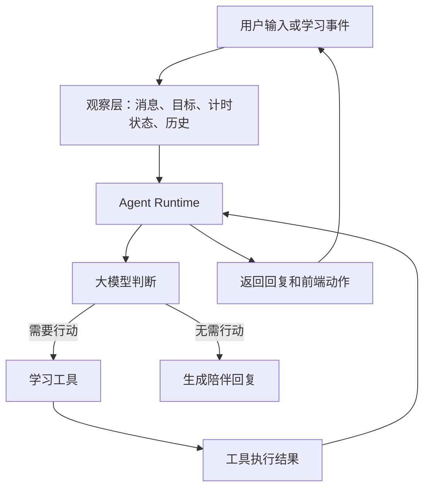

# AI 学习搭子项目改进迭代方案

> 文档状态：待评审  
> 适用项目：AI 学习搭子 · 自习室  
> 制定依据：项目全局检查、自动测试结果、产品文档与实际代码对照、`agent-blueprint` Harness 方法论  
> 核心结论：当前产品是“带 AI 聊天能力的学习陪伴 MVP”，下一阶段应先解决可靠性问题，再升级为最小可用的 Agent Harness。

---

## 一、给产品负责人的简单结论

目前产品已经可以演示和邀请少量用户体验，已有登录、AI 陪聊、语音、番茄钟和学习统计等功能。

但它还不适合直接大规模推广，主要原因是：

1. 学习数据保存在服务器本地文件中，可能丢失或发生冲突。
2. 同一个邀请码会被当成同一个用户，不能真正做到一人一账号。
3. 连续学习天数、本周学习天数存在计算错误。
4. AI 不记得前面聊过什么，也不能自己操作目标、番茄钟和统计。
5. 项目里同时保留了三代前端和多份重复、过期文档，接手者容易混淆。
6. 自动测试大部分正常，但正式前端测试仍使用旧邀请码。

因此，建议按照下面的顺序推进：

```text
先把现有功能修稳定
→ 再把账号和数据存储做可靠
→ 再让 AI 拥有工具、状态和记忆
→ 最后增加主动陪伴、埋点和长期运营能力
```

不建议现在就增加多 Agent、复杂工作流、实时数字人等功能。它们成本高，但不能解决当前最重要的问题。

---

## 二、项目当前状态

### 2.1 已经完成的能力

- Next.js 移动端正式前端：陪伴、专注、我的、登录四个页面。
- FastAPI 后端和统一 `/api/v1` 接口。
- GLM 对话能力，失败时自动切换本地话术。
- 男生、女生两种搭子形象。
- 浏览器语音识别和 Edge TTS 语音合成。
- 25 分钟专注、5 分钟休息的番茄钟。
- 番茄数、专注时长、连续天数、学习日历。
- 邀请码登录、Bearer Token 和按邀请码划分数据目录。
- 火山引擎 veFaaS 前后端独立部署配置。
- 后端单元测试和前端 Playwright 测试。

### 2.2 已验证结果

- 后端测试：44 项通过。
- 前端 ESLint：通过。
- Next.js 使用 webpack 的生产构建：通过。
- 默认 Turbopack 构建：在当前环境因内部端口绑定失败。
- Playwright：3 项中 2 项通过；登录后核心流程因为测试仍使用旧邀请码 `DEMO123` 而失败。

### 2.3 当前产品的真实定位

当前调用方式基本是：

```text
用户输入一句话 → 后端调用一次模型 → 返回一句回复 → 本轮结束
```

因此它属于“AI 功能型应用”，还不是完整的 Agent Harness。模型目前不能自己观察学习状态、选择工具、执行动作并检查结果。

### 2.4 对照 Agent Harness 的必要组成检查表

下面只列“AI 学习搭子”真正需要的组成部分。多 Agent 团队、MCP、复杂工作流等暂时不属于必要项。

| Agent Harness 必要组成 | 大白话解释 | 当前项目已有内容 | 当前状态 | 主要缺失 | 建议落地位置 | 优先级 |
|---|---|---|---|---|---|---|
| 模型与角色 | AI 的大脑以及“小悟是谁” | 已接入 GLM，已有小悟的人设 Prompt，本地话术可降级 | ✅ 已有 | Prompt 版本没有单独管理；缺少稳定的输出格式 | `backend/app/agent/prompt.py` | P1 |
| Agent 循环 | AI 不只回答一次，而是可以“判断—行动—看结果—再判断” | 当前每条消息只调用一次模型并返回文字 | ❌ 缺失 | 没有循环、最大轮数、停止条件和工具结果回传 | `backend/app/agent/runtime.py` | P1 |
| 工具系统 | 把“设目标、查统计、开始专注”等能力变成 AI 可以选择使用的工具 | 后端已有目标、统计、历史、TTS 接口 | ⚠️ 部分具备 | 这些接口只能由网页调用；没有工具说明、参数格式、工具注册表和统一执行入口 | `backend/app/agent/tools.py` | P1 |
| 状态观察 | 让 AI 知道用户现在正在做什么 | 网页自己知道番茄钟状态，后端知道部分学习数据 | ⚠️ 部分具备 | AI 看不到当前计时、今日目标、近期学习情况和语音偏好 | `backend/app/agent/observations.py` | P1 |
| 行动与结果反馈 | AI 提出动作，系统执行后再把结果告诉 AI | 网页按钮可以开始计时；后端可以保存记录 | ⚠️ 部分具备 | 没有统一动作协议；AI 不能请求前端开始/暂停；执行结果不会回到 AI | 后端 `actions` 响应 + 前端动作处理器 | P1 |
| 工具权限 | 决定哪些动作可以自动做，哪些必须让用户确认 | 有邀请码登录和接口鉴权 | ⚠️ 部分具备 | 登录鉴权不等于 Agent 权限；缺少工具白名单、用户确认和敏感动作拦截 | `backend/app/agent/permissions.py` | P1 |
| 会话记忆 | 让 AI 记住刚才聊过什么 | 前端页面暂时显示聊天消息 | ❌ 缺失 | 历史没有发送给模型，刷新后消息消失，连续聊天容易答非所问 | `chat_sessions`、`chat_messages` + 上下文组装器 | P1 |
| 用户长期记忆 | 记住用户长期稳定的学习偏好 | 本地保存男女形象和语音开关 | ⚠️ 部分具备 | AI 不能读取这些偏好；没有偏好筛选、用户查看、修改和删除能力 | `user_preferences` + 记忆服务 | P2 |
| 目标管理 | 让 AI 知道这次学习想完成什么 | 后端已有目标读取和保存 API | ⚠️ 部分具备 | 正式前端没有目标入口，聊天没有传入目标，也没有按日期管理 | `daily_goals` + 前端目标组件 | P1 |
| 完成判断 | 判断一轮学习是否真的完成，避免漏加数据 | 番茄钟结束时由前端调用完成接口 | ⚠️ 部分具备 | 缺少本轮唯一 ID、可信完成状态和防重复结算 | `study_sessions` + 幂等结算接口 | P0 |
| 持久数据 | 服务重启或更新后，账号、记忆和学习记录仍然存在 | 当前使用本地 JSON 文件 | ⚠️ 部分具备 | serverless 环境可能丢失数据，多实例不共享，并发写入可能冲突 | SQLite（本地）/ PostgreSQL（线上） | P0 |
| 日志与观察结果 | 能查清 AI 做了什么、哪里失败、是否切换了降级方案 | 有少量控制台输出和自动测试 | ❌ 缺失 | 没有统一调用日志、工具轨迹、耗时、失败率和隐私脱敏 | `agent_events` + 结构化日志 | P1 |
| 错误降级 | 模型或工具失败时，用户仍能继续使用 | 对话和 TTS 已有本地话术或静默降级 | ✅ 基本已有 | 工具执行、数据库和动作失败还缺少统一降级方式 | Agent Runtime + 统一错误处理 | P1 |
| 情绪安全 | 用户表达严重焦虑或危险情绪时，不能继续普通鼓励 | Prompt 只规定不回答专业知识 | ❌ 缺失 | 缺少危机内容识别、固定安全回复和人工帮助引导 | `backend/app/core/safety.py` | P1 |

状态说明：

- ✅ 已有：可以继续使用，只需整理或加强。
- ⚠️ 部分具备：已经有基础零件，但还没有接入 Agent Harness。
- ❌ 缺失：需要新增。

其中最关键的四个缺口是：

1. **Agent 循环**：让 AI 能连续判断，而不是只回答一句。
2. **工具系统**：让 AI 能使用目标、专注和统计功能。
3. **状态观察**：让 AI 知道用户当前的学习状态。
4. **会话记忆**：让 AI 记得前文，能够连续陪伴。

但实施时不能直接从这四项开始。上线数据目前不够可靠，因此实际顺序应是：

```text
先修持久数据和番茄结算（P0）
→ 再补 Agent 循环、工具、观察、动作和权限（P1）
→ 再补会话记忆、长期偏好和主动陪伴（P1/P2）
```

---

## 三、本轮迭代目标与边界

### 3.1 总目标

把项目从“可以演示的 AI 陪伴 MVP”升级为：

> 数据可靠、账号独立、聊天有记忆、AI 能在安全边界内使用学习工具的最小 Agent Harness 产品。

### 3.2 成功标准

完成本方案后，应满足：

1. 每个用户拥有独立账号和独立学习数据。
2. 服务重启、重新部署、多实例运行时，数据不会丢失。
3. 本周专注天数、连续天数和历史统计准确。
4. 用户关闭页面再回来，番茄钟状态能够正确恢复或结算。
5. AI 能记住当前对话、今日目标和必要的用户偏好。
6. AI 能安全调用“目标、专注、统计”等工具，并向前端返回明确动作。
7. 每次 AI 回复、工具调用、失败降级都有日志可查。
8. 核心用户流程自动测试全部通过。

### 3.3 本轮暂不做

- 不做多个 Agent 团队。
- 不接复杂 MCP 插件生态。
- 不做 Live2D 或实时数字人口型。
- 不做多人视频自习室。
- 不做完整社交系统。
- 不做复杂任务管理系统。
- 不在数据可靠性解决前增加大量运营功能。

---

## 四、改进路线总览

| 阶段 | 目的 | 主要成果 | 优先级 |
|---|---|---|---|
| 第 0 阶段 | 修复现有问题 | 统计、计时、语音、测试、文档恢复可信 | P0 |
| 第 1 阶段 | 账号与数据可靠化 | 真正的用户账号、数据库、数据迁移 | P0 |
| 第 2 阶段 | 最小 Agent Harness | Agent 循环、工具、观察、动作协议 | P1 |
| 第 3 阶段 | 记忆与陪伴升级 | 连续聊天、用户偏好、目标上下文 | P1 |
| 第 4 阶段 | 安全与运营闭环 | 情绪安全、日志、埋点、灰度发布 | P1 |
| 第 5 阶段 | 产品增强 | 周报、成就、提醒、形象升级 | P2 |

---

## 五、第 0 阶段：先修稳定，不增加新功能

### 5.1 修复学习统计

当前问题：

- 跨天时会清空之前的 `weekDays`，导致本周专注天数不准确。
- 昨天已经连续学习，今天第一次完成番茄钟后，连续天数没有加一。
- 日期使用服务器本地时间，云端服务器时区可能与中国用户不一致。

改进任务：

- 统一使用用户时区，MVP 默认 `Asia/Shanghai`。
- 本周专注天数从每日历史记录计算，不再依赖容易被重置的快照。
- 连续天数从历史记录计算，避免单独维护两份容易不一致的数据。
- 增加跨天、跨周、断签、连续三天等测试。

验收标准：

- 周一、周二分别完成一次，页面显示本周专注 2 天。
- 连续三天完成学习，连续天数显示 3。
- 中断一天后再次完成，连续天数从 1 重新开始。

### 5.2 修复番茄钟恢复

当前问题：

- 用户关闭页面期间番茄钟已结束，再打开时不会自动结算。
- 后端保存失败时，前端仍临时把番茄数加一，造成假成功。

改进任务：

- 保存 `startAt`、`endAt`、模式和本轮唯一 ID。
- 页面恢复时判断是否已到结束时间。
- 使用本轮唯一 ID 保证同一轮番茄钟只结算一次。
- 后端失败时显示“保存失败，点击重试”，不能假装成功。

验收标准：

- 倒计时中刷新页面，剩余时间正确。
- 关闭页面超过结束时间后再打开，只补记一次。
- 重复刷新不会重复增加番茄数。

### 5.3 统一语音开关

当前问题：

- 陪伴页关闭语音后，专注页仍可能播放 TTS。
- 已经发出的 TTS 请求可能在关闭语音后继续播放。

改进任务：

- 把语音设置提取为全局状态。
- 陪伴页和专注页共同读取同一个设置。
- 关闭语音时取消或忽略尚未完成的 TTS 请求。
- 播放结束、被打断或请求过期时释放音频资源。

### 5.4 修复测试与构建

改进任务：

- Playwright 不再硬编码真实邀请码。
- 测试启动后端时注入专用测试邀请码。
- 增加统计跨天、番茄恢复、语音关闭和 Token 过期测试。
- 在 Turbopack 环境问题解决前，生产构建明确使用 `next build --webpack`。
- CI 至少执行：后端测试、前端 lint、前端 build、核心 E2E。

验收标准：

- 一条命令可以完成全部检查。
- 测试不依赖开发者本地 `.env`。
- 所有核心测试通过后才允许部署。

### 5.5 整理项目和文档

当前项目存在三代前端：

1. `study-buddy/index.html`：最早原型。
2. `backend/app/static/index.html`：后端内嵌旧版 H5。
3. `frontend/`：当前正式 Next.js 前端。

改进任务：

- 将前两代前端移动到明确的 `archive/` 或 `legacy/` 目录。
- README 只介绍当前正式前端和后端的启动方法。
- 删除或合并完全重复的 PRD、技术手册。
- 更新 `.env.example`，补充 `INVITE_CODES`、`AUTH_SECRET`、时区和数据库配置说明。
- 前端 README 替换 create-next-app 默认内容。
- 文档中不再使用“静态图片视频”容易误解的说法，改为“视频自习室风格的视觉陪伴”。

---

## 六、第 1 阶段：账号与数据可靠化

### 6.1 把邀请码和用户身份分开

当前逻辑是“一个邀请码等于一个用户”。这会导致多人使用同一个邀请码时共享数据。

建议改为：

```text
邀请码：只负责允许注册
用户账号：负责识别具体用户
用户 ID：负责隔离每个人的数据
```

MVP 可选方案：

- 用户输入邀请码后，再通过手机号、邮箱或设备账号建立个人身份。
- 邀请码可以设置使用次数和失效时间。
- Token 支持过期、退出登录和撤销。
- 不再在公开 README 中公布生产邀请码。

验收标准：

- 两个人使用同一个邀请码注册后，得到不同用户 ID。
- 两人的学习记录完全隔离。
- 用户可以退出登录。
- 失效邀请码不能继续注册，但已注册用户可以正常登录。

### 6.2 将 JSON 文件迁移到数据库

开发环境建议使用 SQLite，线上环境建议使用 PostgreSQL 或平台提供的可靠数据库。

最低数据表：

| 数据表 | 保存内容 |
|---|---|
| `users` | 用户 ID、账号信息、创建时间、时区 |
| `invite_codes` | 邀请码、使用次数、有效期、状态 |
| `study_sessions` | 每次专注的开始、结束、时长、状态、唯一 ID |
| `daily_goals` | 用户每天的学习目标 |
| `chat_sessions` | 一次聊天会话 |
| `chat_messages` | 用户和搭子的历史消息 |
| `user_preferences` | 形象、语音开关、陪伴偏好 |
| `agent_events` | AI 回复、工具调用、失败和降级记录 |

迁移要求：

- 编写一次性迁移脚本，把现有 JSON 数据导入数据库。
- 迁移前保留备份。
- 相同番茄钟唯一 ID 不能重复入库。
- 迁移成功并核对数量后，再切换正式接口。

---

## 七、第 2 阶段：升级为最小 Agent Harness

### 7.1 目标结构

升级后的核心流程：



### 7.2 增加 Agent Runtime

增加一个小型、有限轮次的 Agent 循环：

1. 接收用户消息和当前学习状态。
2. 把可用工具告诉模型。
3. 模型选择回复或调用工具。
4. 后端执行允许的工具。
5. 将工具结果交回模型。
6. 模型生成最终回复和前端动作。

安全限制：

- 每次请求最多执行有限轮数，例如 3 至 5 轮。
- 每次最多调用有限数量工具。
- 超时或模型异常时退回本地陪伴话术。
- AI 不直接执行任意 Shell、文件或网络命令。

### 7.3 第一批 Agent 工具

只加入学习搭子真正需要的工具：

| 工具 | 作用 | 是否产生数据变化 | 权限 |
|---|---|---:|---|
| `get_today_goal` | 查看今日目标 | 否 | 自动允许 |
| `set_today_goal` | 设置今日目标 | 是 | 用户明确表达后允许 |
| `get_focus_state` | 查看番茄钟状态 | 否 | 自动允许 |
| `suggest_focus` | 建议开始专注 | 否 | 自动允许 |
| `request_start_focus` | 请求前端开始番茄钟 | 是 | 前端让用户确认 |
| `request_pause_focus` | 请求前端暂停 | 是 | 用户明确表达后允许 |
| `complete_focus` | 结算已完成专注 | 是 | 需要有效的本轮唯一 ID |
| `get_study_stats` | 查看统计和历史 | 否 | 自动允许 |
| `update_preference` | 更新形象或语音偏好 | 是 | 用户明确表达后允许 |

不允许模型直接修改番茄数。完成记录必须来自可信计时状态和唯一 ID。

### 7.4 建立前端动作协议

后端响应从单纯文字升级为：

```json
{
  "reply": "今天先背 50 个单词，我们开一轮专注吗？",
  "source": "llm",
  "actions": [
    {
      "type": "confirm_start_focus",
      "durationMinutes": 25
    }
  ]
}
```

前端只执行白名单动作。涉及开始、暂停、覆盖目标等操作时，应先显示确认按钮，不能由 AI 静默操作。

### 7.5 Agent 观察内容

每次请求只给 AI 必要信息：

- 用户最新消息。
- 最近几轮聊天摘要。
- 今日目标。
- 当前番茄钟状态。
- 今日完成次数和本周专注天数。
- 用户选择的搭子形象和语音偏好。

不要把完整数据库、全部历史或敏感账号信息发给模型。

---

## 八、第 3 阶段：记忆与真人陪伴升级

### 8.1 会话内记忆

- 保存最近若干轮对话。
- 每次聊天带上必要的前文。
- 超过长度后生成摘要，不把全部历史无限发送给模型。
- 用户开启新话题时允许新建会话。

### 8.2 跨会话记忆

只记录以后仍有价值的信息，例如：

- 用户喜欢安静陪伴还是经常鼓励。
- 用户常用的专注时长。
- 用户偏好的搭子形象和声音。
- 用户主动要求记住的学习习惯。

不应该自动长期记录：

- 临时情绪。
- 与学习无关的敏感隐私。
- 未经确认的模型推测。
- 完整原始语音。

用户需要能够查看、修改和删除记忆。

### 8.3 让今日目标进入真实闭环

完整流程应变为：

```text
用户设置目标
→ AI 确认目标
→ AI 建议一轮专注
→ 用户确认开始
→ 中途根据偏好保持安静或适度鼓励
→ 完成后可靠结算
→ AI 根据目标和实际完成情况总结
```

### 8.4 主动陪伴规则

第一版主动陪伴应由确定性规则触发，AI 负责生成合适表达：

- 专注开始：一句简短确认。
- 专注过半：仅在用户允许时提醒。
- 专注完成：庆祝并展示结果。
- 连续暂停：询问是否需要缩短本轮时间。
- 多日未学习：只有用户主动订阅提醒后才发送。

不要让模型无限自主决定何时打扰用户。

---

## 九、第 4 阶段：安全、日志与运营闭环

### 9.1 情绪安全

产品会处理“压力大、焦虑、崩溃”等内容，因此必须增加安全兜底：

- 普通疲惫：陪伴、建议休息。
- 明显危机表达：停止普通鼓励话术，建议立即联系可信的人或当地紧急帮助。
- 不冒充心理医生，不做诊断，不承诺绝对保密。
- 高风险规则不能只依赖系统提示词，应有程序检查和固定兜底文案。

### 9.2 隐私说明

更新隐私说明，明确：

- 用户文字可能发送给所选大模型服务。
- 浏览器语音识别可能使用浏览器或系统提供商的服务。
- TTS 文本会发送给语音合成服务。
- 保存哪些数据、保存多久、如何删除。

不得继续使用“所有内容仅在本机、完全不外传”等与实际实现不一致的描述。

### 9.3 日志与监控

至少记录：

- API 成功率和响应时间。
- LLM、TTS、ASR 的成功与失败。
- 模型回复来源：真实模型或本地降级。
- Agent 调用了什么工具、工具是否成功。
- 番茄钟结算是否成功。
- 登录失败次数和异常访问。

日志中不能记录 Token、邀请码、API Key 和完整敏感聊天内容。

### 9.4 产品指标

北极星继续使用“每周专注天数”，同时观察：

- 新用户首次完成专注的比例。
- 7 日留存率。
- 每周人均专注天数。
- 番茄钟开始到完成的转化率。
- AI 对话后的继续学习率。
- 本地话术降级比例。
- 用户关闭主动提醒或语音的比例。

---

## 十、第 5 阶段：稳定后再增加的功能

完成前四个阶段后，再按数据选择功能：

- 每日或每周学习总结。
- 成就徽章和连续学习激励。
- 自定义专注时长。
- 用户主动订阅的学习提醒。
- 搭子主动播报学习周报。
- 更丰富的形象、表情和轻动画。
- 数据导出与账号注销。

是否开发应根据真实用户数据决定，不建议一次全部实现。

---

## 十一、建议的代码结构

```text
AI学习搭子/
├── backend/
│   ├── app/
│   │   ├── api/                 # HTTP 接口
│   │   ├── agent/
│   │   │   ├── runtime.py       # 有限 Agent 循环
│   │   │   ├── prompt.py        # 搭子身份与安全规则
│   │   │   ├── tools.py         # 工具定义和注册
│   │   │   ├── observations.py  # 组装学习状态
│   │   │   └── permissions.py   # 工具权限判断
│   │   ├── models/              # 数据库模型
│   │   ├── repositories/        # 数据读写
│   │   ├── services/            # 对话、统计、TTS 等业务服务
│   │   └── core/                # 配置、日志、安全
│   ├── migrations/              # 数据库升级脚本
│   └── tests/
├── frontend/                    # 唯一正式前端
├── archive/                     # 历史 H5，仅供参考
├── docs/                        # PRD、架构和运维文档
└── README.md                    # 唯一上手入口
```

---

## 十二、测试与验收方案

### 12.1 自动测试

- 单元测试：统计、连续天数、工具权限、Token、记忆筛选。
- 接口测试：登录、目标、番茄钟结算、历史、Agent 对话。
- Agent 测试：工具选择正确、工具失败能降级、达到轮数上限能停止。
- 前端测试：登录、设置目标、开始专注、恢复计时、完成结算、查看历史。
- 安全测试：越权访问、重复结算、危险情绪输入、敏感日志检查。

### 12.2 人工验收

每次发布前至少走一遍：

```text
新用户注册
→ 设置今日目标
→ 与搭子连续聊天三轮
→ AI 建议开始专注
→ 用户确认
→ 刷新页面恢复计时
→ 完成并结算
→ 在“我的”页面看到正确记录
→ 退出并使用另一账号登录
→ 确认看不到前一个用户的数据
```

### 12.3 上线门槛

- P0 问题全部关闭。
- 自动测试全部通过。
- 数据迁移有备份和回滚方案。
- 不使用默认 `AUTH_SECRET`。
- 生产邀请码不写在代码和公开文档中。
- 线上数据不依赖 serverless 本地文件。

---

## 十三、推荐实施顺序

### 第一批：必须立即处理

1. 修复本周天数和连续天数。
2. 修复过期番茄钟和重复结算。
3. 修复语音开关。
4. 修复 Playwright 测试邀请码。
5. 更新 `.env.example` 和 README。
6. 明确唯一正式前端，归档旧版。

### 第二批：正式推广前必须处理

1. 建立真实用户身份。
2. 迁移到可靠数据库。
3. 增加退出登录、Token 撤销和邀请码管理。
4. 增加日志、监控和数据备份。

### 第三批：Agent Harness 升级

1. 建立有限 Agent 循环。
2. 将目标、专注和统计包装成工具。
3. 建立前端白名单动作协议。
4. 加入会话记忆和用户偏好。
5. 增加工具权限与安全检查。

### 第四批：产品增长

1. 埋点并观察每周专注天数。
2. 根据数据决定是否做周报、提醒和成就。
3. 根据留存表现决定是否升级形象动画或语音服务。

---

## 十四、完成定义

本轮改进只有同时满足以下条件才算完成：

- 用户数据可靠，不因服务器重启或部署丢失。
- 不同用户的数据完全隔离。
- 学习统计经过跨天、跨周测试。
- 番茄钟不会漏记或重复记。
- AI 可以安全地读取目标和统计，并通过工具提出操作。
- 用户拥有最终确认权，AI 不能静默开始或修改重要状态。
- AI 能记住必要上下文，同时允许用户删除记忆。
- 所有重要动作都有日志，但日志不泄露密钥和敏感信息。
- 核心自动测试和人工验收全部通过。
- README、PRD 和实际产品保持一致。

---

## 十五、最终建议

这个项目不需要推倒重做。现有前端、后端、对话、语音和番茄钟都可以继续使用。

正确的升级方式是：

> 保留现有产品外壳，先修数据和账号，再在后端增加一层轻量 Agent Runtime，把已有功能逐步变成 AI 可以安全调用的工具。

这样既能保住已经完成的成果，也能让产品真正从“会聊天的网页”升级为“能够理解目标、观察学习状态并协助行动的 AI 学习搭子”。
